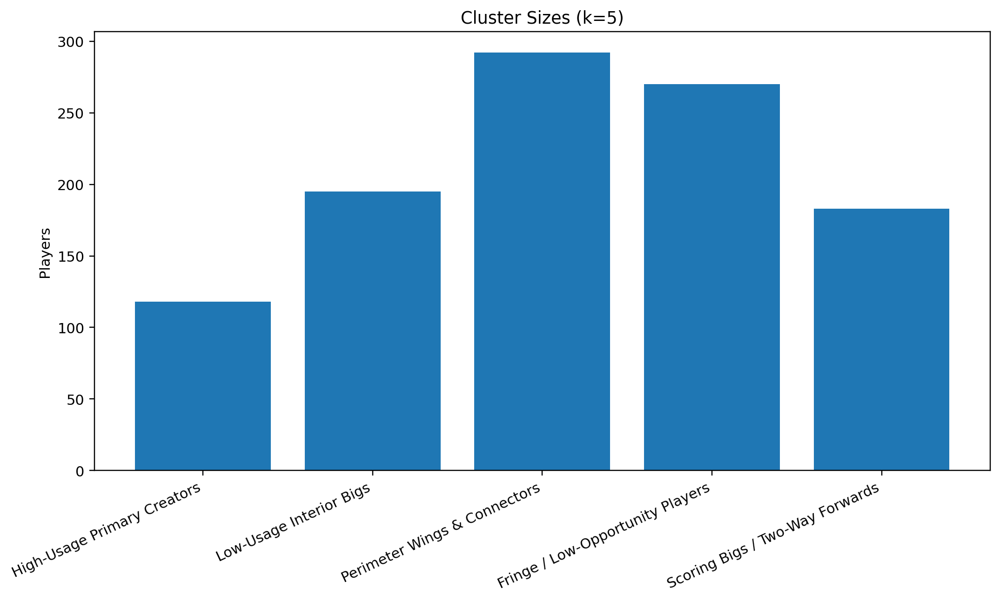
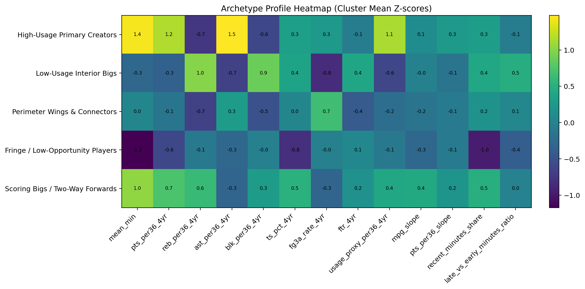
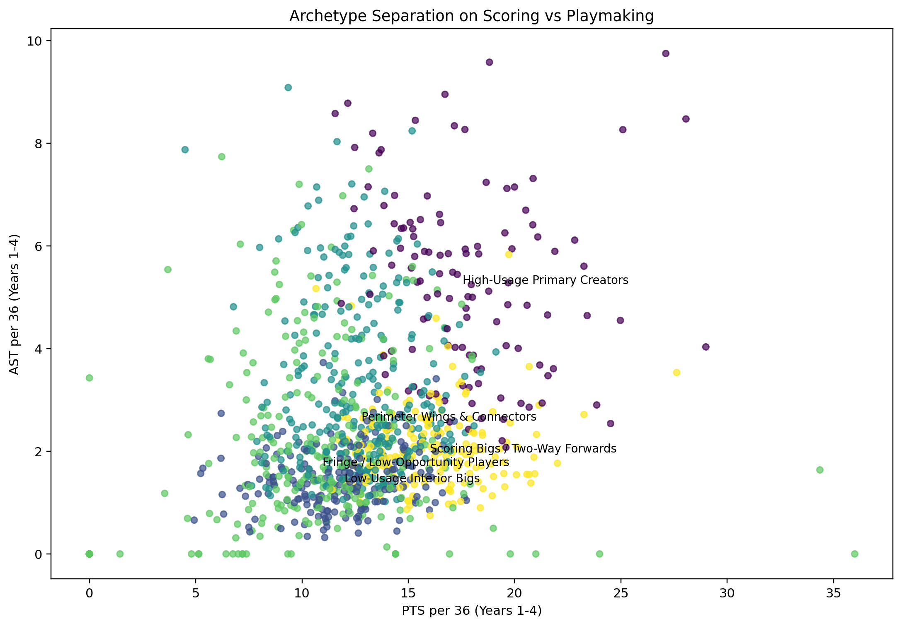

## Objective

Build a multi-module player future analysis system that uses a rookie’s first 4 NBA seasons to support post-rookie extension decisions.

Instead of producing only one forecast, we build a compact decision system that evaluates:

- future performance
- future durability
- contract value
- indicator of potential sleeper / neutral / bust
- front-office action

Core outputs for decision recommendation include but not limited to:

- Post-rookie performance forecast
- Post-rookie contract value as salary-cap %
- Player Archetype & Comparable Profile

## Target Audience and Our Roles
**Primary audience**

- NBA front offices
- Basketball operations groups
- Contract strategy teams

**Secondary audience**

Players and agents evaluating contract asks and market position

**Who we are**

Senior Data Scientists in the Basketball Analytics group of an NBA franchise

## Final deliverables

**Our approach:** a multi-module, role-aware forecasting system

**Traditional approach:** aggregate box-score stats + linear / logistic regression, common in basketball analytics because box-score data are the most available and easy to interpret.

  - **Main limitation:** averages flatten the player’s path and can miss important signals in the development trajectory, usage, and role evolution.

We present the project as **3 main final deliverables**

## Deliverable 1 — Performance Forecast

**What we investigate**

- Years 5--7 basketball performance
- Sleeper / Neutral / Bust outcome
- uncertainty around the forecast

**Method**

- baseline logistic regression / classification models first
- LSTM hybrid sequence model on Seasons 1-4 game-by-game logs
- confidence band from repeated splits / bootstrap / ensemble-style uncertainty

##
**Final output**

- predicted Years 5-7 production
- sleeper / neutral / bust probabilities
- floor / base / ceiling forecast
- skillset radar chart (showcase example)

::: {.text-right}
{width="30%"}
Source: Jacobs (2016)
:::

## Deliverable 2 — Player Archetype & Comparable Profile

**What we investigate**

- current player archetype
- identity drift / role evolution
- realistic comparable players
- historical role model
- similarity score and comp-group outcome context

##
**Method**

- **PCA + K-means** for early-career archetypes
- nearest neighbors in PCA / archetype space for realistic comps
- post-1990 Hall of Fame library for historical role models
- **ShotChartDetail core pipeline**
  - pull Seasons 1-4 shot spatialtemporal data (LOC_X, LOC_Y, shot type, clock, period, result)
  - bin shots into player-season spatial tensors
  - train a CNN autoencoder
  - export shot-style embeddings
  - use embeddings for comps and shot-style drift

##
**Final output**

- archetype label + archetype match score
- realistic comps + historical role models if justified
- similarity score
- median later-career outcome of realistic comp group
- role / shot-style evolution summary

## Deliverable 3 — Salary Decision Support

**What we investigate**

- Year-5 contract value as salary-cap %
- durability / missed-time risk
- final extension stance

##
**Method**

- merge player salary history with salary-cap history
- baseline salary regression, with optional LSTM salary head if coverage is stable
- durability risk model from games, minutes, rest gaps, and participation stability
- rules-based recommendation quadrant combining:
  - forecast
  - salary value
  - durability risk
  - comps
  - uncertainty

##
**Final output**

- Year-5 salary-cap % forecast
- durability / risk band
- recommendation:
  - Extend Aggressively
  - Extend at Disciplined Price
  - Wait and Reassess
  - Avoid Overcommitting

## Why a multi-module system?

**Data Limits**

- NBA downstream targets are player-level, not million-row  data
- NBA’s official player-tracking data became league-wide in the 2013–14 season, and current NBA tracking pages still note that tracking is not available for all games
- not all players have full Years 5–7 outcomes
- current files are boxscore-based, frame-by-frame tracking spatiotemporal data is mostly locked behind NBA/Second Spectrum

So instead of forcing all sophistication into one unified model, we aim for more coverage, compactness, and decision value across several modules:

- coverage across multiple decision angles
- compactness in one integrated player dossier
- honesty about uncertainty and sample attrition
- business value for post-rookie contract decisions

## Background: The Business Story
**Why Use Seasons 1--4**

* The first four seasons match the rookie-contract window, when teams must judge long-term value

* Rookie extension decisions are high-stakes and made before full career outcomes are visible

* Season 1--4 data contain early signals on usage, efficiency, durability, and development path

We frame this as an **RFA war room** problem: pay now, proceed carefully, or avoid overcommitting

**Forecast Window**

* Years 5--7 are a natural post-rookie window to evaluate whether early signals translate into sustained value

## Workflow

1. **Cohort + targets** Years 5--7 performance, Year-5 cap %, Sleeper/Neutral/Bust
2. **Feature engineering** player-level table + game-sequence table + durability features
3. **Archetype learning** PCA + K-means (k = 5) for early-career player types
4. **Shot-style module** ShotChartDetail -> spatial tensors -> CNN autoencoder -> shot embeddings
5. **Archetype & comps** archetype, role evolution, realistic comps, HOF ceiling comps
6. **Performance forecast** baseline models + K-fold LSTM hybrid + uncertainty band
7. **Salary decision support** salary-cap % forecast + durability risk + recommendation quadrant
8. **Final deliverables** Performance Forecast / Archetype & Comparable Profile / Salary Decision Support

## Data Resources and Scraping

**Cohort:** 1247 drafted players from 1999-2019 (from *nba_api*)

**Rookie-contract logs:** Seasons 1-4 game-by-game NBA boxscore data (179819 games) to build player-level features and sequence data (from *nba_api*)

**Later-career total (targets):** realized player-season outcomes used to build post-rookie years performance labels and contract value labels (from *nba_api* and *basketball-reference.com*)

**Contract data:** Scrape per player per year salary data from Hoopshype (1990 - 2019) + Historical NBA salary cap table to create salary-cap % target (from *https://www.hoopshype.com* and *https://www.basketball-reference.com/contracts/salary-cap-history.html*)

**Historical comps:** scrape post 1990 "Hall of Fame" players career trajectories (Season 1-4 game-by-game box scores + later-career outcomes) (from *https://www.nba.com/news/basketball-hall-of-fame-all-time* and *nba_api*)

## 
**ShotChartDetail:** nba_api - scrape per-shot spatiotemporal records with LOC_X and LOC_Y, plus shooter, period, clock, shot type, result, and distance. (requires roughly 4,000 API calls， ~1.4 Million raw spatial events, not yet integrated)

**PlayByPlayV3:** nba_api - event-level spatiotemporal timeline data with clock, period, descriptions, and legacy shot/event coordinates xLegacy / yLegacy (optional, not yet integrated)

**NCAA Game logs:** scrape players' NCAA game logs for potential early-career signals (optional, not yet integrated)

**Injury data:** scrape players' injury history for durability features and potential injury-risk signals (optional, not yet integrated)

## PCA: turning many features into a compact player space

**Input:** Seasons 1--4 flattened player feature table  

**Features used:** four-year production, efficiency, workload, slopes, and season-block summaries  

**Preprocessing:** winsorize outliers, median impute missing values, standardize features  

**Method:** PCA, keeping enough components to explain 85% of variance

**Purpose:** reduce noise and collinearity before clustering  

**Output:** low-dimensional PCA scores for each player  

**Use in project:** direct input to K-means archetype clustering and comparable-player analysis

## PCA + K-means Archetype Model

- Clustered **1,058 players** using **24 PCA components** and **k = 5** clusters
- Silhouette score in PCA space: **0.107**
- Archetypes found:
  - High-Usage Primary Creators (118): High assists, strong scoring, high usage, meaningful minutes
  - Low-Usage Interior Bigs (195): High rebounds and blocks, low 3PA tendency, lower usage
  - Perimeter Wings & Connectors (292): Wing-like shooting profile, moderate playmaking, balanced usage
  - Fringe / Low-Opportunity Players (270): Lowest minutes and weakest opportunity profile
  - Scoring Bigs / Two-Way Forwards (183): Strong scoring, rebounding / block profile, more frontcourt production

## PCA + K-means Results Snapshot

::: columns
::: {.column width="58%"}
{width=100%}
:::
::: {.column width="42%"}
- PCA gives a compact player map
- K-means learns **5 role-based archetypes**
- Archetypes become model inputs:
  - one-hot clusters
  - centroid distances
- Better peer-group comparison
- Better stakeholder interpretation
:::
:::

## Cluster Size and Sample Balance

::: columns
::: {.column width="58%"}
{width=100%}
:::
::: {.column width="42%"}
- No archetype is tiny or degenerate  
- Largest groups are "Fringe / Low-Opportunity" and "Perimeter Wings & Connectors"
- Smallest group is "High-Usage Primary Creators", which is expected because true initiators are rarer
- This gives us usable coverage across all 5 archetypes for downstream modeling
:::
:::

## How the 5 Archetypes Differ

::: columns
::: {.column width="62%"}
{width=100%}
:::
::: {.column width="38%"}
- Heatmap shows **cluster mean z-scores**
- Compare archetypes on the same standardized scale
- Main dimensions include:
  - minutes / opportunity
  - scoring
  - playmaking
  - rebounding / rim protection
  - shooting profile
  - usage and development path
:::
:::

## Intuitive Basketball View: Scoring vs Playmaking

::: columns
::: {.column width="58%"}
{width=100%}
:::
::: {.column width="42%"}
- Plots archetypes using **PTS per 36** and **AST per 36**
- Gives a simple basketball interpretation of the clusters
- **Primary Creators** separate through higher assist load
- **Scoring Bigs / Two-Way Forwards** separate through scoring without creator-level passing
- **Fringe players** stay low on both dimensions
- Helps explain why pooled league-wide comparisons can be misleading
:::
:::

## Why the Archetypes Matter Downstream

Archetypes are **not just side visuals**

They become model inputs through:

  - **cluster one-hot indicators**
  - **distance-to-centroid variables**
  - **own-cluster distance** as a prototype-fit / ambiguity measure

This helps us:

  - compare players within the **right peer group**
  - improve baseline models with role-aware predictors
  - concatenate archetype information into the **LSTM hybrid model**
  - support comparable-player search and player dossier storytelling

## Game Data Available - Shooting Statistics
- FGM (Field Goals Made): Total number of baskets made (includes both 2-pointers and 3-pointers, but not free throws).
- FGA (Field Goals Attempted): Total number of shots taken.
- FG_PCT (Field Goal Percentage): The percentage of shots made (FGM / FGA).
- FG3M (3-Point Field Goals Made): Number of 3-point shots made.
- FG3A (3-Point Field Goals Attempted): Number of 3-point shots taken.
- FG3_PCT (3-Point Percentage): The percentage of 3-point shots made (FG3M / FG3A).
- FTM (Free Throws Made): Number of successful free throws.
- FTA (Free Throws Attempted): Number of free throws taken.
- FT_PCT (Free Throw Percentage): The percentage of free throws made (FTM / FTA).

## Game Data Available - Rebounding & Playmaking
- OREB (Offensive Rebounds): Rebounds grabbed while the player's team is on offense (giving them another chance to score).
- DREB (Defensive Rebounds): Rebounds grabbed while the player's team is on defense.
- REB (Total Rebounds): The sum of Offensive and Defensive rebounds (OREB + DREB).
- AST (Assists): Passes that lead directly to a teammate scoring a basket.

## Game Data Available - Defense & Mistakes
- STL (Steals): Number of times the player legally takes the ball away from an opponent.
- BLK (Blocks): Number of times the player successfully deflects an opponent's shot attempt.
- TOV (Turnovers): Number of times the player loses possession of the ball to the other team (via a bad pass, traveling, getting stolen from, etc.).
- PF (Personal Fouls): Number of fouls committed by the player in that game.

## Game Data Available - Overall Impact
- PTS (Points): Total points scored by the player in that game.
- PLUS_MINUS (+/-): A metric showing the team's point differential while that specific player was on the court. A "+8" means the team scored 8 more points than the opponent while Zion was playing. A "-21" means they were outscored by 21 points while he was on the floor.

## Player Performance Analysis
- We want to calculate the player performance for each game & for each season/year.
- Several Options
- Game Score: created by John Hollinger, this is essentially a "single-game PER" (Player Efficiency Rating). It gives a rough, all-in-one number indicating how productive a player was in a specific game. A score of 10 is average, and 40 is an all-time great performance.

$GmSc = PTS + 0.4 * FGM - 0.7 * FGA - 0.4 * (FTA - FTM) + 0.7 * OREB + 0.3 * DREB + STL + 0.7 * AST + 0.7 * BLK - 0.4 * PF - TOV$

## Player Performance Analysis

- Value Point System: based on a formula that assesses performance based upon several offensive and defensive stats. The higher the number, the better. A VPS of 1 is about average.

$VPS = \frac{PTS + REB + 2 * AST + 2 * (STL + BLK)}{2 * (FGA - FGM) + (FTA - FTM) + 2 * PF + 2 * TOV}$

- True Shooting Percentage: measures a player's efficiency at shooting the ball across all types of shots.

$TS\% = \frac{PTS}{2 * (FGA + 0.44 * FTA)}$

## Multinomial logistic regression 

- We use multinomial logistic regression to predict a player’s final career outcome class from their first four years of NBA data.

- The three classes are Sleeper, Neutral, and Bust.

- The goal is to see whether early-career opportunity, efficiency, production, trend, and stability can help explain which direction a player’s later career will go.

## What we need to do

1. Build the outcome score as Y
-  Use career total performance data
-  Turn the scores into final labels: Sleeper / Neutral / Bust

2. Decide the predictor variables as X
-  Use information from the player’s first 4 seasons
-  Include opportunity, efficiency, production, trend, stability, and cluster features

3. Fit multinomial logistic regression
-  Predict the three outcome classes from early-career features

4. Evaluate model performance
-  Check accuracy, macro-F1, and confusion matrix
-  See how well the model separates Sleeper, Neutral, and Bust

## How We Found the Outcome Scores

- Summarize long-term career performance base on player performance analysis
- Apply PCA to create realized outcome scores
- Compare actual score with expected score, we used the ridge regression
- Use residuals to measure over- or under-performance
- Classify each player as Sleeper / Neutral / Bust
- Use majority vote to get the final class label
- "Sleeper": 0, "Neutral": 1, "Bust": 2

## How We Built the Multinomial Logistic Regression

- Use the final label as the target variable, with three classes: Sleeper, Neutral, and Bust.

- Use selected early-career features as predictors, including opportunity, efficiency, per-36 production, trend, stability, and cluster information.

- Treat the cluster variable as categorical using one-hot encoding, and standardize the numeric predictors before modeling.

- Fit a multinomial logistic regression model and evaluate it with metrics such as accuracy, macro-F1, and the confusion matrix.

## Result from Multinomial Logistic Regression

{width=100%}

## Feature importance for class 0

{width=100%}

## Feature importance for class 1

{width=100%}

## Feature importance for class 2

{width=100%}

## Feature importance Overall

{width=100%}