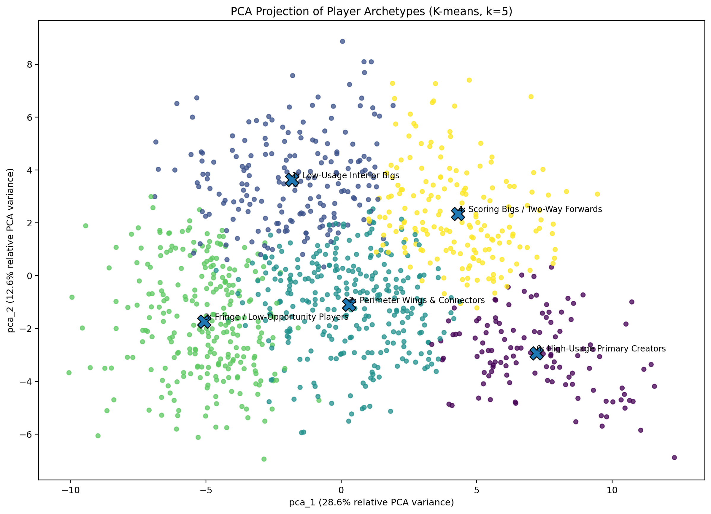

```{r}
#| label: setup
library(readr)
library(dplyr)
library(knitr)
library(stringr)
library(tibble)

output_dir <- normalizePath("../Output/Player Archetype Analysis", winslash = "/", mustWork = TRUE)
output_salary_dir <- normalizePath("../Output/Salary Decision Support", winslash = "/", mustWork = TRUE)
visual_dir <- normalizePath("../visual/Player Archetype", winslash = "/", mustWork = TRUE)
dossier_output_dir <- normalizePath(file.path(output_dir, "player_dossier_demo"), winslash = "/", mustWork = TRUE)
dossier_visual_dir <- normalizePath(file.path(visual_dir, "player_dossier_demo"), winslash = "/", mustWork = TRUE)

macro_summary <- read_csv(file.path(output_dir, "archetype_macro_summary_table.csv"), show_col_types = FALSE)
shot_summary <- read_csv(file.path(output_dir, "shot_style_cluster_summary.csv"), show_col_types = FALSE)
drift_table <- read_csv(file.path(output_dir, "player_identity_drift_table.csv"), show_col_types = FALSE)
comp_dossier <- read_csv(file.path(output_dir, "player_comp_dossier_table.csv"), show_col_types = FALSE)
final_profiles <- read_csv(file.path(output_dir, "final_player_archetype_profile_table.csv"), show_col_types = FALSE)
cohort_audit <- read_csv(file.path(output_dir, "cohort_join_audit.csv"), show_col_types = FALSE)
dossier_selection <- read_csv(file.path(dossier_output_dir, "report_ready_player_dossier_selection.csv"), show_col_types = FALSE)

output_player_cluster_dir <- normalizePath(
  "../src/Player_Performance_Clustering/Result",
  winslash = "/",
  mustWork = TRUE
)

output_sal_forecast_dir <- normalizePath(
  "../src/5th_Year_Salary_Analysis/Result",
  winslash = "/",
  mustWork = TRUE
)

visual_cluster_dir_1 <- normalizePath("../visual/Player_Clustering",winslash = "/",mustWork = TRUE)
visual_salary_dir_1 <- normalizePath("../visual/Salary_Forecast",winslash = "/",mustWork = TRUE)

n_candidates <- nrow(cohort_audit)
n_fully_covered <- sum(cohort_audit$fully_covered_for_hybrid_pipeline, na.rm = TRUE)
coverage_pct <- round(100 * n_fully_covered / n_candidates, 1)

drift_counts <- drift_table %>%
  count(identity_drift_class, name = "players") %>%
  mutate(share = round(100 * players / sum(players), 1))

macro_table_exec <- macro_summary %>%
  transmute(
    `Macro role family` = macro_archetype,
    `Representative players` = representative_players,
    `Minutes` = round(mean_min_mean, 1),
    `PTS/36` = round(pts_per36_4yr_mean, 1),
    `REB/36` = round(reb_per36_4yr_mean, 1),
    `AST/36` = round(ast_per36_4yr_mean, 1)
  )

shot_table_exec <- shot_summary %>%
  transmute(
    `Shot-style subtype` = shot_style_subtype,
    `Players` = subtype_size,
    `Avg. membership prob.` = round(avg_membership_probability, 3),
    `Avg. entropy` = round(avg_entropy, 3),
    `Style note` = descriptive_style_notes
  )

drift_table_exec <- drift_counts %>%
  transmute(
    `Drift class` = identity_drift_class,
    `Players` = players,
    `Share (%)` = share
  )

case_table_exec <- final_profiles %>%
  filter(PLAYER_NAME %in% c("Trae Young", "Kemba Walker", "Roy Hibbert", "Nikola Vučević", "Kyle O'Quinn")) %>%
  transmute(
    Player = PLAYER_NAME,
    `Hybrid archetype` = hybrid_archetype_label,
    `Drift class` = identity_drift_class,
    `Realistic comps` = realistic_comp_list,
    `Ceiling analog` = ceiling_comp_PLAYER_NAME,
    `Comp group median points` = round(median_comp_group_points, 1),
    `Comp group median minutes` = round(median_comp_group_minutes, 1)
  )
```

\newpage

# Context

This is an executive report for a full multi-module player future analysis system on NBA post-rookie forecasting and extension valuation. The organizational setting is an NBA front office evaluating players at the end of the rookie-contract window, when the team must decide whether to extend, wait, or redirect resources elsewhere. 

## Audience

The audience is a decision-maker who cares about risk, role clarity, expected future value, and contract discipline rather than model novelty for its own sake. More specifically, the practical audience includes:

**Primary Audience**:

- NBA front offices
- Basketball operations groups
- Contract strategy teams

**Secondary Audience**:

Players and agents evaluating contract asks and market position

## Who We Are

Senior Data Scientists in the Basketball Analytics group of an NBA franchise

## Business Problem and Project Motivation

The business horizon is anchored in the structure of the rookie contract itself. The first four NBA seasons define the evaluation window in which teams learn what a player is, how stable that identity appears to be, and whether the underlying production profile is likely to sustain into the next contract phase. Years 5--7 define the practical post-rookie outcome horizon: that is the range in which forecasting, archetype interpretation, and salary planning have to meet.

The broader project is organized into three linked final deliverables:

1. **Performance Forecast**: A forward-looking module for Years 5--7 production and broad outcome classification.

2. **Player Archetype \& Comparable Profile**: A player-intelligence module that identifies what kind of player this is, how stable that identity appears to be, and which historical players provide the best realistic precedent.

3. **Salary Decision Support**: A decision layer translating projected player value and risk into extension-oriented pay guidance.

\newpage

# Response to Feedback

The project was substantially revised after the Progress Update to improve clarity, strengthen justification, and better align the final report with its intended decision-support purpose. A repeated concern from both the professor and peer reviewers was that the system was ambitious and well motivated, but risked feeling too broad, too fragmented, and not sufficiently clear about which outputs mattered most for decision-making. In response, the final report is now organized as one front-office workflow with three linked deliverables so that each module answers one practical decision question and feeds directly into the next. This restructuring makes the final report more cohesive and more consistent with the actual rookie-extension setting.  

A second major revision was to make the integration across modules much more explicit. Earlier feedback noted that the pipeline contained many sophisticated components, but their relationship to the final decision rule was not always clear. The finalized report addresses that by making Module 3 the clear synthesis layer. Rather than presenting salary as a separate technical output, the report now shows how forecast results, archetype context, realistic comparables, and market anchors are combined into a structured contract posture built around protected / fair / walk-away pricing and staged extension guidance. This directly responds to the request for a more formalized and decision-facing final rule.  

The report was also revised to address comments about coherence and presentation clarity. Earlier feedback suggested that the system felt disjointed, overly dense, and too eager to include every technical detail in the main story. The final version therefore separates the decision narrative from the technical support more carefully. The main text now emphasizes the business question, design choice, and practical takeaway of each deliverable, while much of the detailed methodology is moved to the appendices. This change was made to improve readability and ensure that technical complexity supports the story rather than overwhelming it. 

Another important revision concerns the shot-style module. Reviewers noted that the CNN autoencoder and shot embeddings were sophisticated, but could feel disconnected from the core objective. In the final report, that layer is now clearly positioned inside Deliverable 2 rather than alongside it: shot-style embeddings are used to refine archetype interpretation, support identity drift analysis, and improve realistic comparable-player search. This makes the shot-style component an operational part of the player-intelligence workflow rather than an isolated technical add-on.  

The final report also responds more directly to concerns about feasibility, validation, and statistical discipline. Peer reviewers asked for clearer treatment of label construction, class balance, train/test logic, uncertainty, and the practical value of the LSTM relative to simpler baselines. In response, the report now explains the Sleeper / Neutral / Bust labels more explicitly as an expectation-versus-realization framework, reports direct logistic-versus-LSTM comparison results, and keeps the interpretation cautious where the performance gain from the sequence model is limited. It is also more explicit that evaluation is carried out in a held-out decision setting, and that uncertainty is carried forward into the salary layer rather than ignored.  

Finally, the report was revised to be more transparent about scope boundaries. Earlier feedback raised concern that some parts of the system were still only partially integrated. The final report now distinguishes more clearly between what is broadly active, what is available only on the supported overlap, and what remains conditional under current data coverage. This is especially important in the salary-decision chapter, where the report separates the broader comp-based market-anchor layer from the narrower forecast-adjusted supported subset. That makes the final system more credible because it no longer implies uniform strength across the whole cohort. Overall, the main revision was not to remove complexity, but to make every module earn its place inside one coherent extension-decision workflow.   

\newpage

# Introduction

The project studies a decision every front office eventually faces: **what should we believe about this player before the post-rookie extension decision hardens into dollars?** That question is easy to blur into general optimism or pessimism. Good organizations try not to do that. They want a structured answer that separates current identity, likely future performance, and contract consequence.

The first four NBA seasons provide the natural evidence window. By then, the organization has seen enough to evaluate role, usage, style, health exposure, and developmental direction. The next three seasons, Years 5--7, provide the practical forecast horizon because that is where extension value is realized or lost.

That is why the project is organized into three deliverables rather than one omnibus model:

- **Performance Forecast** asks what performance level the player is likely to produce in Years 5--7 and how much uncertainty should attach to that forecast.

- **Player Archetype \& Comparable Profile** asks what kind of player this is right now, how stable that identity appears to be, and who has looked like this before.

- **Salary \& Extension Guidance** asks how the organization should translate projected value and risk into salary-cap terms and extension guidance.

This division of labor is deliberate. Forecasting without player identity can be numerically clever but basketball-thin. Archetyping without decision translation can be descriptive but not actionable. Salary guidance without both can become disguised guesswork. The project is intended to connect those layers rather than pretend one model can answer every part of the problem alone.

This report is trying to produce a clearer answer to four executive questions:

1. What is this player right now?
2. How likely is that identity to hold?
3. What sort of later-career performance should comparable evidence make us expect?
4. How aggressively should we pay for that expectation?

# Player Performance Forecast
## Decision Problem and Design Choice

Module 1 is intended to answer the project’s forward-looking performance question: **given the player’s first four NBA seasons, what should the organization expect in Years 5--7?** In business terms, this is the production-risk module. It is meant to estimate future performance level, distinguish likely sleepers from neutral outcomes and bust trajectories, and attach a credible sense of uncertainty to those expectations.

## Player Performance Forecast Methodology

We use the Game Score metric, designed to measure a player's productivity, as our target metric. The 5 to 7 year Game Score is calculated using a player's combined box score as input, see ([Appendix A1.1](#appendix-a1-1)):

We then designed a Neural Network that takes 4 years of NBA data of a given player to predict the 5 to 7 year Game Score. We input shots level, game level and seasonal level data for the given player's 1 to 4 year data. Then use a Shot encoder to processes individual shot events within a game to capture micro-level performance and a Game encoder to combined game-level box score statistics with the learned shot profiles. These are then fused with explicit seasonal metrics and fed into a Gated Recurrent Unit (GRU) to model the player's four-year career trajectory, which is finally processed by a regression head to predict their 5 to 7 year Game Score.

We then plot the residual and use Monte Carlo Dropout to evaluate the model's accuracy and uncertainty, see ([Appendix A1.2](#appendix-a1-2))

Bellow is a table showcasing the predicted and actual Game Score of two example players: Nikola Vučević and Trae Young.

{#fig-game-score-example width=90% fig-align="center"}

An alternative version of the model predicts 5 different metrics to create a radar chart for the player, see ([Appendix A1.3](#appendix-a1-3))

## Player Classification

For the classification layer, we use only the Seasons 1–4 information to predict whether a player’s Years 5–7 outcome is best described as Bust, Neutral, or Sleeper. These class labels are not assigned by hand; instead, they are constructed from an expectation-versus-realization framework, where early-career performance defines the expected level and Years 5–7 performance defines the realized level. To translate that continuous comparison into stable outcome groups, we tested both PCA-based. 

We used those PCA-K-means labels as targets, then trained both an interpretable multinomial logistic regression baseline and a sequence-based LSTM classifier, where the input is the player’s first four seasons, and the output is class probability over Bust, Neutral, and Sleeper. The following are the direct results of the comparison between LSTM and Logistic regression.

We also compared it with another clustering method, T-SNE. ([Appendix A1.4](#appendix-a1-4))


```{r}
library(readr)
library(dplyr)
library(knitr)
library(kableExtra)

# read saved csv
comparison_metrics <- read_csv(
  file.path(output_player_cluster_dir, "comparison_metrics.csv"),
  show_col_types = FALSE
)

d3_target <- read_csv(file.path(output_salary_dir, "salary_target_audit_summary.csv"), show_col_types = FALSE)

# format values
comparison_metrics_show <- comparison_metrics %>%
  mutate(
    accuracy_test_sample = sprintf("%.4f", accuracy_test_sample)
  )

# show table
comparison_metrics_show %>%
  kable(
    col.names = c("model", "accuracy_test_sample"),
    align = c("l", "r"),
    caption = "Model Accuracy Comparison (Test Dataset)",
    booktabs = TRUE
  ) %>%
  kable_styling(
    latex_options = c("hold_position"),
    full_width = FALSE,
    font_size = 12
  )
```

Based on the model comparison result, LSTM is the better final choice when the goal is forward-looking player classification rather than only interpretability. That means LSTM can better capture development paths, timing, and year-to-year changes, which is useful when separating players whose averages look similar but whose trajectories differ. For other detailed comparison results, please see the references. ([Appendix A1.5](#appendix-a1-5))

## Final Takeaway: The Player Performance Forecast
Module 1 features an LSTM-based forecasting package that predicts player outcomes for Years 5–7 as Bust, Neutral, or Sleeper. Rather than offering a simple label, the system provides a full class-probability vector to quantify decision risk; a dominant probability signals stability, while diffuse mass indicates higher uncertainty. Ultimately, the module translates these probabilities into three actionable outputs per player: a predicted outcome group, a quantified confidence signal, and a strategic recommendation ranging from aggressive commitment to cautious avoidance.

The practical takeaway of this module is a player-level forecasting card for Years 5–7. That card aggregates the predicted outcome class, class probabilities, and confidence-based uncertainty into a compact summary that can be carried directly into salary-decision modules. In that sense, the workflow is not intended to stop at technical classification alone. It is intended to produce a usable decision object that tells the front office what broad future trajectory the player is most likely to follow, how reliable that signal appears to be, and how much caution or aggressiveness that forecast should support in later decision layers.

```{r, echo=FALSE, fig.align="center", out.width="99%"}
library(knitr)
knitr::include_graphics(file.path(visual_cluster_dir_1, "selected_players_radar.png"))
```

In the case illustrations, Trae Young profiles as a clear Sleeper-type upside case: relative to the Sleeper benchmark, his first-four-year profile shows especially strong scoring, shooting, playmaking, and ball-security signals, which is consistent with the interpretation of an offensive engine whose later-career trajectory justifies aggressive attention. Nikola Vučević presents a more mixed profile. Relative to the Neutral benchmark, his scoring, rebounding, and defensive dimensions are strong, but the overall shape is less dominant and less scarce than Trae Young’s, which supports a more measured reading of his later-career value. 

In conclusion, the LSTM model organizes uncertainty into an interpretable output: an expected future class, associated class probabilities, and a confidence signal that can be carried forward into salary-decision layers. That makes Deliverable 1 a practical first screen for extension-oriented decision support rather than a standalone technical exercise. Please see the reference for details.([Appendix A1.6](#appendix-a1-6))

# Player Archetype & Comparable Profile
## Decision Problem and Design Choice

Performance forecast tells the front office which rookies have outperformed enough to merit serious extension consideration. Player archetype analysis begins where that screen ends. Once the candidate pool is narrowed, the key question is no longer simply who produced, but what type of player the team would actually be extending and whether that player fits the current roster construction. In other words, among the over-performing rookies identified by the forecast layer, which ones fit the team better, and what kind of player profile is the team actually trying to add or retain?

This module is built to answer that next basketball decision directly: who is this player now, how stable is that identity, who has looked like this before, and what kind of upside is genuinely consistent with team fit? In the broader report logic, this is exactly the middle layer between pure forecasting and salary guidance: it translates early-career evidence into player identity and precedent rather than leaving the front office with forecast numbers alone.

## Hybrid Archetype Workflow: PCA + K-means \rightarrow CNN Autoencoder + Gaussian Mixture

The workflow defines archetype as a layered rather than a one-label construct. The first layer is a **macro role backbone** learned from the existing Seasons 1--4 boxscore feature table using PCA + K-means clustering results with $K=5$. This gives five broad role families that remain compact enough for executive interpretation while still separating major basketball functions. The second layer is a **shot-style subtype** where player-season shot maps are placed on a common half-court grid, compressed into an embedding space by a CNN autoencoder ([Appendix A2.6](#appendix-a2-6)), and then grouped with a Gaussian mixture model so subtype membership can be probabilistic rather than artificially hard ([Appendix A2.7](#appendix-a2-7)). The third layer is **early-career drift**, which tracks whether the player’s role and shot identity from Seasons 1--4 remained stable, evolved gradually, or shifted materially. These layers are then linked to realistic comparables, optional Hall-of-Fame ceiling analogs, and a final stakeholder-facing dossier.

The macro role layer remains the boxscore backbone of the system. It is broad enough to be readable, but broad enough to be incomplete, which is precisely why the shot-style layer is needed. The full cohort distribution is shown in Appendix @fig-macro-chart.

```{=latex}
\begin{table}[htbp]
\centering
\Huge
\resizebox{\textwidth}{!}{%
\begin{tabular}{llrrrr}
\toprule
Macro role family & Representative players & Minutes & PTS/36 & REB/36 & AST/36 \\
\midrule
High-Usage Primary Creators & Brandon Knight, Rodney Stuckey, Kemba Walker, Isaiah Thomas, Bradley Beal & 30.4 & 17.7 & 4.4 & 5.3 \\
Low-Usage Interior Bigs & Ed Davis, Jake Tsakalidis, Todd MacCulloch, Jason Smith, Trevor Booker & 15.5 & 11.9 & 9.1 & 1.5 \\
Perimeter Wings \& Connectors & Svi Mykhailiuk, Damyean Dotson, Wayne Ellington, E'Twaun Moore, Timothe Luwawu-Cabarrot & 18.3 & 12.7 & 4.6 & 3.2 \\
Fringe / Low-Opportunity Players & Nick Johnson, Damir Markota, Damien Inglis, Antonis Fotsis, Kim English & 7.8 & 10.9 & 6.2 & 2.2 \\
Scoring Bigs / Two-Way Forwards & Markieff Morris, Willie Cauley-Stein, Aaron Gordon, Myles Turner, Marvin Williams & 26.9 & 16.1 & 8.1 & 2.1 \\
\bottomrule
\end{tabular}%
}
\caption{Macro role backbone. These five role families come from the PCA + K-means artifacts and are retained as the interpretable boxscore foundation for the broader player-intelligence workflow.}
\label{tab:macro}
\end{table}
```
Table \ref{tab:macro} shows the role-family logic clearly: high-usage creators carry the offensive burden, interior bigs dominate the rebounding and rim profile, perimeter connectors occupy the lower-usage linkage middle, and scoring bigs / two-way forwards sit in a distinct frontcourt scoring space. That macro structure is necessary for front-office readability, but not sufficient for full player typing.

The shot-style layer sharpens that reading. Instead of treating all players in the same macro family as stylistically interchangeable, the spatial pipeline separates downhill rim pressure, three-level balance, arc-heavy spacing, interior finishing, and midrange-oriented creation. Because the subtype model is built with a Gaussian mixture model, subtype fit is allowed to be strong, weak, or ambiguous, which is more realistic for basketball styles than a rigid hard assignment. The subtype distribution and on-court subtype dictionary are reported in Appendix @fig-shot-summary and Appendix @fig-subtype-dictionary.

```{r}
#| label: tbl-shot
#| tbl-cap: "Learned shot-style subtype summary. Membership is probabilistic because the subtype model allows overlapping spatial identities; ambiguity is therefore treated as information rather than failure."
library(kableExtra)

kable(
  shot_table_exec,
  booktabs = TRUE,
  longtable = FALSE,
  align = c("l", "r", "r", "r", "l")
) |>
  column_spec(1, width = "2.8cm") |>
  column_spec(5, width = "6.5cm") |>
  kable_styling(
    latex_options = c("hold_position", "scale_down"),
    font_size = 8,
    position = "center"
  )
```

@tbl-shot gives the learned shot-style taxonomy used in the hybrid archetype. These subtype labels are descriptive summaries of learned spatial structure rather than externally validated basketball ontology classes, but they are still decision-useful because they distinguish players who share a broad role family yet generate offense from materially different court locations.

Static identity is still not enough, so the workflow adds a drift layer. Using season-level boxscore movement and season-level shot embeddings, the model asks whether the player’s Year-4 profile reflects a reinforced identity, a gradual evolution, or a materially shifting role. That movement evidence is critical because endpoint similarity can hide very different developmental paths. The drift showcase is reported in Appendix @fig-drift-cases.

The comparable-player layer then translates identity into precedent. Realistic comps are the main evidence and are built from macro-role compatibility, prototype fit, shot-style distance, and drift-relevant structure rather than from a simple “same cluster” lookup. Hall-of-Fame analogs are retained separately as ceiling comps only. They are useful for upside framing, but they should not be interpreted as expected outcomes. The compact comp extraction table is reported in Appendix @tbl-case-profiles.

## Final Takeaway: The Player Dossier

The practical output of this module is the player dossier card. That card aggregates the current hybrid archetype, subtype confidence, prototype-fit ambiguity, drift class, realistic comp group, optional ceiling analog, and comp-group later-career context into a front-office-facing summary. In other words, the workflow is not meant to stop at taxonomy. It is meant to end in a usable decision object. The sample integrated dossier visual is reported in Appendix @fig-sample-dossier. And we will use 2 player-specific dossier cards @fig-trae-dossier and @fig-vucevic-dossier for explaining the value of the final output.

{#fig-trae-dossier fig-pos='H'}

{#fig-vucevic-dossier fig-pos='H'}

Trae Young and Nikola Vučević show why that aggregation matters. Trae Young’s dossier reads as an offensive engine: a lead creator whose value is tied to primary initiation and scoring burden, and whose role family is relatively scarce. Vučević’s dossier reads as a very different kind of asset: a skilled scoring big whose offensive development is meaningful, but whose archetype is more replaceable than that of a primary creator. Both players can look strong by the end of Year 4, but they do not represent the same contract bet. One profiles like a franchise-driving offensive hub; the other profiles like a valuable frontcourt scorer whose market should be judged more carefully against role scarcity and replaceability.

In conclusion, forecast numbers alone can suggest that two players project well, but they cannot by themselves explain what kind of value is being bought, how rare that role is, how the player got there, or which historical paths are truly comparable. The dossier exists to organize that missing decision context. Extension decisions are comparative judgments under uncertainty. This module does not remove uncertainty, but it organizes it better.

## Limitations and Credibility

First, the shot-style subtype labels are descriptive post-hoc names rather than externally validated basketball ontology classes. Second, Hall-of-Fame ceiling analogs are auxiliary and aspirational, not realistic comps. Third, identity drift in boxscore role space is approximated in standardized season-feature space, which is informative but still imperfect. 

Most importantly, this is an analytic module designed to improve decision support, not to replace judgment. The conclusion is to impose better discipline on the questions a front office was already going to ask.

# Salary Decision Support
## Decision Problem and Design Choice
This is the natural final stage of the project. Module 1 identifies which players deserve serious future-value attention. Module 2 clarifies what kind of player the team would actually be extending, how stable that identity appears to be, and what realistic historical precedents look like. Module 3 then turns those earlier signals into contract-facing guidance. Once the front office has narrowed the field, the next practical question that ultimately drives the extension decision is no longer only whether the player is promising, but how much the team should offer and how aggressively it should act.

For that reason, this module is framed as salary decision support rather than as a pure salary model. A front office is not asking for one mathematically convenient number in isolation. It is asking for a disciplined range, a negotiation stance, and a reasoned explanation of why the organization should move early, stay price-sensitive, or remain cautious. The design choice of this chapter is therefore to build a structured decision layer rather than to let one regression output stand in for the full extension question.

## Workflow and Methodology
The workflow is organized as a staged pricing framework. First, Year-5 contract value is normalized as salary-cap percentage rather than raw dollars so that the contract discussion remains comparable across changing cap environments.([Appendix A3.1](#appendix-a3-1)) Second, that normalized salary target is linked to the realistic comparable-player infrastructure from player archetype analysis.([Appendix A3.2](#appendix-a3-2)) Those realistic comparable players are then used to construct a market anchor with three interpretable price levels: a protected price, a fair price, and a walk-away maximum. This turns the comp layer from descriptive basketball context into contract discipline. ([Appendix A3.3](#appendix-a3-3))

The next layer adds a baseline salary model. That model acts as a second valuation lens that can either support the comp-based band or warn that a player’s statistical profile looks cheaper or more expensive than the comparable-player market alone suggests. ([Appendix A3.4](#appendix-a3-4))In practical terms, the organization is not asked to choose one source of evidence blindly. It is asked to compare a historical market view against a structured predictive view before settling on contract posture.

After that, module 3 adds action logic. Role scarcity, comparable-player support, and identity clarity help determine whether the team should push early inside the justified range or remain more disciplined even when the player is extension-worthy. ([Appendix A3.5](#appendix-a3-5)) In that sense, the system does not stop at fair value. It explicitly asks how assertively the team should behave around that value.

The final layer uses performance-forecasting results from module 1 in the way a front office would actually use them at the rookie-extension window. The held-out **146-player** test subset is treated as a retrospective out-of-sample decision group: players whose later path is unknown at decision time, but for whom the system can still produce Sleeper / Neutral / Bust probabilities, a confidence-based uncertainty proxy, and forward-looking performance forecasts. In practical terms, this is the same decision setting the model is meant to support when a real front office evaluates a current rookie-extension case. Module 3 then takes those forecast signals and asks the next contract-facing question: how should they change the pricing and negotiation posture? Under the current salary-data coverage, **138** of those out-of-sample players carry enough matched Year-5 salary support to push all the way through the forecast-adjusted salary layer, so that group functions as the clearest demonstration of how the full extension workflow operates in practice rather than as a narrow technical footnote. ([Appendix A3.6](#appendix-a3-6))

The appendix contains the detailed target-construction, comp-weighting, salary-model, and merge mechanics. Here the essential message is simpler: Module 3 turns forecast evidence, player identity, and historical market structure into a contract-decision framework that is directly usable for real extension investigations.  

## Final Takeaway: Extension Guidance in Practice

Trae Young, Nikola Vučević, and Andrew Bynum are used here as retrospective Year-4 case studies. They are not meant to stand in for the full cohort. Instead, they show how the final salary-decision-support workflow turns earlier forecast and archetype evidence into concrete extension-facing outputs: a protected / fair / walk-away contract band, an internal negotiation posture, and a staged extension stance. Under the current project scope, these three rows are useful because they make the salary-decision workflow visible without requiring the report to overclaim full-cohort final guidance.

```{=latex}
\setlength{\tabcolsep}{1pt}
```
```{r}
#| label: tbl-d3-cases
#| tbl-cap: "Final case-study outputs. Reported values are drawn directly from the staged final workflow table and show only technical decision metrics rather than narrative interpretation."
library(readr)
library(dplyr)
library(stringr)
library(kableExtra)

d3_cases_raw <- read_csv(
  file.path(output_salary_dir, "deliverable3_final_case_study_table.csv"),
  show_col_types = FALSE
)

d3_case_tbl <- d3_cases_raw %>%
  mutate(
    sort_id = case_when(
      PLAYER_NAME == "Trae Young" ~ 1L,
      PLAYER_NAME %in% c("Nikola Vučević", "Nikola Vucevic") ~ 2L,
      PLAYER_NAME == "Andrew Bynum" ~ 3L,
      TRUE ~ 999L
    )
  ) %>%
  filter(sort_id < 999L) %>%
  arrange(sort_id) %>%
  transmute(
    Player = PLAYER_NAME,
    Archetype = hybrid_archetype_label %>%
      str_replace_all("&#124;", "|") %>%
      str_replace_all("\\s*\\|\\s*", " / ") %>%
      str_squish(),
    Prot = sprintf("%.1f%%", 100 * protected_price_cap_pct),
    Fair = sprintf("%.1f%%", 100 * fair_price_cap_pct),
    Walk = sprintf("%.1f%%", 100 * walk_away_max_cap_pct),
    Open = sprintf("%.1f%%", 100 * staged_open_cap_pct),
    Tgt = sprintf("%.1f%%", 100 * staged_target_cap_pct),
    Max = sprintf("%.1f%%", 100 * staged_hard_max_cap_pct),
    PredictedClass = paste(predicted_class),
    Adj = forecast_adjustment_mode %>%
      str_replace_all("_", " ") %>%
      str_to_title(),
    Stance = staged_extension_stance_label
  ) %>%
  as.data.frame()

kable(
  d3_case_tbl,
  booktabs = TRUE,
  escape = TRUE,
  align = c("l", "l", rep("r", 6), "l", "l", "l")
) |>
  column_spec(1, width = "2.3cm") |>
  column_spec(2, width = "4.4cm") |>
  column_spec(9, width = "2.0cm") |>
  column_spec(10, width = "2.4cm") |>
  column_spec(11, width = "2.5cm") |>
  kable_styling(
    latex_options = c("hold_position", "scale_down"),
    font_size = 7,
    position = "left",
    full_width = FALSE
  )
```

```{=latex}
\setlength{\tabcolsep}{6pt}
```

@tbl-d3-cases shows that the three players do not produce the same contract signal even though all three are credible retrospective extension cases. Trae Young remains the clearest aggressive case. His final workflow row reports a protected price of **25.0%** of cap, a fair price of **25.3%**, and a walk-away maximum of **25.3%**, with an internal negotiation posture of **25.2% open / 25.3% target / 25.3% hard max**. The final staged stance is therefore **Offer now**. In technical terms, the recommendation follows from a narrow justified band, strong support, and an adjustment mode of **upside_push_within_band**, which means the forecast layer strengthens an already concentrated and defensible market position rather than forcing a new premium outside the current band.

Nikola Vučević now illustrates a more informative forecast-updated case than in earlier drafts. His final row reports a protected price of **13.7%** of cap, a fair price of **18.8%**, and a walk-away maximum of **22.9%**, with an internal posture of **16.5% open / 18.8% target / 22.9% hard max**. The final staged stance is also **Offer now**. Importantly, however, that does not make his contract case identical to Trae Young’s. Vučević’s band remains materially wider than Trae’s. The upside signal is strong enough to move him out of the disciplined-price framing, but the broader protected / fair / walk-away structure still shows that his negotiation environment is less concentrated and therefore less cleanly aggressive than Trae Young’s.

Andrew Bynum provides the contrasting waiting case. The framework reports a protected price of **7.2%** of cap, a fair price of **11.2%**, and a walk-away maximum of **17.3%**, with an internal posture of **7.2% open / 9.2% target / 11.2% hard max**. The final staged stance is **Wait and save flexibility**, with an adjustment mode of **hold_band_with_neutral_support**. In practical terms, that means the framework does not reject the player outright, but it also does not see enough evidence to justify an aggressive early push. This is the value of the third example: it shows that the system is not designed to convert every promising retrospective case into “offer now.” It is willing to preserve timing flexibility when the current evidence remains more balanced.

Taken together, those three cases show what salary decision support is meant to accomplish. The workflow is not only sorting players into better and worse categories. It is showing how different technical contract outputs — especially the protected / fair / walk-away structure, the open / target / hard-max posture, and the supported forecast layer — should lead to different extension behavior. Trae Young’s case is an early-commitment case because the justified range is already narrow and the player’s role is harder to replace. Vučević’s case shows how an updated upside signal can strengthen the recommendation into an offer-now posture without erasing the fact that the market band is still wider than Trae Young’s. Andrew Bynum’s case shows the opposite side of the system: a player can still remain extension-relevant while the workflow recommends waiting and preserving flexibility rather than locking into an early commitment. The table therefore reports the technical decision metrics first, and the interpretation follows from those metrics rather than being embedded inside the result table itself.
([Appendix A3.8](#appendix-a3-8))

## Limitations and Credibility
First, this chapter remains a staged final framework rather than a single fully validated full-cohort recommendation engine. The market-anchor and provisional pricing layers are available more broadly, while the strongest forecast-adjusted salary logic is concentrated on the supported overlap. Second, the current uncertainty input is still a confidence proxy inherited from the forecast handoff rather than a richer interval-style uncertainty package. Third, durability and availability risk are not yet fully embedded in the final extension posture.

The main value of the current design is not that it covers every player uniformly, but that it creates a consistent retrospective decision sample. The held-out **146-player** subset carries both the later-performance forecast outputs and the Sleeper / Neutral / Bust classification results, so these players can be treated as realistic “unknown future” rookie-extension cases under the study design. That makes the supported subset especially useful for showing how the framework behaves when the organization must commit before the player’s later trajectory is known. Trae Young, Nikola Vučević, and Andrew Bynum therefore function as concrete examples of that decision setting rather than as isolated anecdotes.

At the same time, the calibration of the salary-decision layer is still affected by uncertainty upstream. Even when the forecast and classification outputs come from the same held-out test subset, those predictions still carry residual forecasting error, and that uncertainty necessarily propagates into extension guidance whenever the forecast layer is allowed to adjust contract posture. For that reason, the project treats forecast-adjusted guidance as strongest on the supported overlap and keeps the adjustment conservative, mainly changing how hard the team should push within the existing protected / fair / walk-away band rather than authorizing uncontrolled expansion beyond it.

Credibility also varies across player types rather than remaining constant across the cohort. The current baseline salary model is the selected Ridge specification, used as a predictive cross-check against the comp-market anchor rather than as a replacement for it.

```{r, echo=FALSE, fig.align="center", out.width="70%"}
library(knitr)
knitr::include_graphics(file.path(visual_salary_dir_1, "bias_top5_groups_large_error.png"))
```

The figure provides a targeted uncertainty diagnostic for the salary-model layer by showing the five player groups with the highest bias-adjusted large-error percentage, where a large error is defined as ∣error∣≥0.03 in predicted Year-5 salary-cap percentage. Rather than asking whether the baseline works equally well for everyone, this plot shows where salary prediction is most unstable across class, age, macro archetype, and shot-style subtype. For details on the ridge prediction model, please see [Appendix A3.9](#appendix-a3-9).

The highest-error groups are concentrated among rim-pressure players, especially primary creators and scoring bigs, with the strongest concentration in the 23–24 age range. This matters because those players often sit in a difficult valuation zone between proven production and projected upside, so their contracts depend more heavily on team belief, role leverage, and future development than on stable historical salary comparables alone. Although the selected Ridge baseline provides a reasonably strong overall fit and captures the general salary pattern well, especially in the middle of the distribution, this diagnostic shows that calibration is materially less stable for those archetypes. As a result, the current framework is more credible as a disciplined decision baseline than as a mechanically precise pricing engine for every player type, and salary suggestions for these rim-pressure creator and scoring-big profiles should therefore be treated with added caution. For more details, please see [Appendix A3.9](#appendix-a3-9).

The point of this module is that the project already provides a coherent decision workflow for extension timing and price discipline under partial future information, which is exactly the setting front offices actually face. That is enough to make this module decision-useful now, while still leaving room for fuller integration later.

# Conclusion
## Final Takeaway: A Structured Extension-decision Workflow
Taken together, the three modules turn rookie-extension analysis into a single decision workflow: forecast what the player is likely to become, clarify what type of player the team is actually paying for, and translate that evidence into a disciplined contract posture. The key practical value is that the system produces a usable extension view built around future trajectory, player identity, realistic precedent, and a protected / fair / walk-away negotiation range.

Most importantly, the held-out 146-player test subset behaves like a real front-office decision setting. Those players carry later-performance forecast outputs, Sleeper / Neutral / Bust results, and archetype-based context, so they can be treated as realistic “unknown future” rookie-extension cases under the study design. That is why Trae Young, Nikola Vučević, and Andrew Bynum matter here: they are not isolated anecdotes, but concrete examples of how the framework supports different extension choices when the organization must commit before the later trajectory is known. 

## Next-step
The next step is to revisit and extend the workflow as the market sample grows. A larger pool of rookie-extension cases, salary matches, and comparable-player precedents would make the market-anchor layer broader, reduce dependence on thinner player-type pockets, and allow the same decision logic to be applied with more confidence across a wider set of extension candidates. 

The framework should also be strengthened by incorporating more professional basketball-context analysis on external drivers of player development that are not modeled here, such as injury history and medical risk, team role and coaching changes, roster competition, usage environment, organizational development quality, playoff versus regular-season context, and off-court or behavioral factors that can affect continuity and growth. In other words, the current system provides a disciplined core decision structure, but its next improvement is to combine a deeper historical market base with richer contextual signals that front offices already use when judging whether early-career performance is likely to hold, improve, or break.

# References
*n.d. for no date*

Basketball Reference. (n.d.). *Glossary*. Sports Reference LLC. Retrieved April 19, 2026, from [https://www.basketball-reference.com/about/glossary.html](https://www.basketball-reference.com/about/glossary.html)

Basketball Reference. (n.d.). *NBA salary cap history*. Sports Reference LLC. Retrieved April 19, 2026, from [https://www.basketball-reference.com/contracts/salary-cap-history.html](https://www.basketball-reference.com/contracts/salary-cap-history.html)

Coon, L. (2022). *NBA salary cap FAQ*. Retrieved April 19, 2026, from [https://www.cbafaq.com/](https://www.cbafaq.com/)

Gal, Y., & Ghahramani, Z. (2016). Dropout as a Bayesian approximation: Representing model uncertainty in deep learning. *Proceedings of Machine Learning Research, 48*, 1050–1059. [https://proceedings.mlr.press/v48/gal16.html](https://proceedings.mlr.press/v48/gal16.html)

HoopsHype. (n.d.). *NBA player salaries*. Retrieved April 19, 2026, from [https://www.hoopshype.com](https://www.hoopshype.com)

Kannan, A., Kuzma, B., & Nannapaneni, R. (2018). Predicting National Basketball Association success: A machine learning approach. *SMU Data Science Review, 1*(3). [https://scholar.smu.edu/datasciencereview/vol1/iss3/7/](https://scholar.smu.edu/datasciencereview/vol1/iss3/7/)

NBA API. (n.d.). *nba_api: An API client to access the APIs of NBA.com*. GitHub. Retrieved April 19, 2026, from [https://github.com/swar/nba_api](https://github.com/swar/nba_api)

NBA API. (n.d.). *ShotChartDetail endpoint*. GitHub. Retrieved April 19, 2026, from [https://github.com/swar/nba_api/blob/master/docs/nba_api/stats/endpoints/shotchartdetail.md](https://github.com/swar/nba_api/blob/master/docs/nba_api/stats/endpoints/shotchartdetail.md)

Turkington, D. (2023). How to predict the performance of NBA draft prospects. *MIT Sloan Sports Analytics Conference*. [https://www.sloansportsconference.com/research-papers/how-to-predict-the-performance-of-nba-draft-prospects](https://www.sloansportsconference.com/research-papers/how-to-predict-the-performance-of-nba-draft-prospects)

Zuccolotto, P., Sandri, M., & Manisera, M. (2023). Spatial performance analysis in basketball with CART, random forest, and extremely randomized trees. *Annals of Operations Research, 325*(1), 225–252. [https://pmc.ncbi.nlm.nih.gov/articles/PMC9164576/](https://pmc.ncbi.nlm.nih.gov/articles/PMC9164576/)

\newpage

# Appendix
## Appendix 1 - Player Performance Forecast
### A1.1 Performance Forecast Model {#appendix-a1-1}

The Chosen target performance metrics is the Game Score:

$$Game Score = PTS + 0.4 \times FGM - 0.7 \times FGA - 0.4 \times (FTA - FTM) + 0.7 \times OREB$$
$$+ 0.3 \times DREB + 1.0 \times STL + 0.7 \times AST + 0.7 \times BLK - 0.4 \times PF - 1.0 \times TOV$$

Where:

* **PTS:** Points Scored

* **FGM:** Field Goals Made

* **FGA:** Field Goals Attempted

* **FTM:** Free Throws Made

* **FTA:** Free Throws Attempted

* **OREB:** Offensive Rebounds

* **DREB:** Defensive Rebounds

* **AST:** Assists

* **STL:** Steals

* **BLK:** Blocks

* **TOV:** Turnovers

* **PF:** Personal Fouls

### A1.2 Game Score Model Performance Analysis {#appendix-a1-2}

To rigorously evaluate the forecasting model, we look beyond simple accuracy metrics and analyze both the model's inherent bias and its predictive uncertainty. We achieve this using **Residual Analysis** and **Monte Carlo (MC) Dropout** inference.

**Residual Analysis: Accuracy and Bias**

The residual plot helps us visualize where the model is making errors by plotting the predicted Game Score against the prediction error (Actual - Predicted).

{#fig-residual}

**Interpretation:**
A perfectly unbiased model would show a random, tightly clustered cloud of points strictly along the red zero-line. As seen in @fig-residual, the model performs quite well for average players (predicted scores between 500 and 1500), where the errors are relatively balanced above and below the line. 

However, as the predicted Game Score increases beyond 1500, the spread of the residuals widens significantly—a classic case of *heteroscedasticity*. The model exhibits a conservative bias; it tends to underpredict major breakouts (the large positive errors at the top right) and occasionally overpredicts players who heavily regressed. It safely "hedges" its bets toward the mean rather than predicting massive superstar leaps.

**Predictive Uncertainty: Monte Carlo Dropout**

Standard point estimates lack confidence measures. By forcing the network's Dropout layers to remain active during testing, we ran 50 distinct forward passes per player to generate a distribution of predictions, allowing us to calculate 95% confidence intervals.

{#fig-uncertainty}

**Interpretation:**
@fig-uncertainty visualizes these confidence intervals (light blue bars) plotted against the perfect prediction line. 

1. **Reliable Baselines:** For the dense cluster of role players and standard starters (Actual Game Score < 2000), the uncertainty bounds are relatively tight and frequently intersect the red line, indicating the model is both highly confident and highly accurate in forecasting standard career trajectories.
2. **Superstar Variance:** For high-performing players (Actual Game Score > 3000), the error bars become massive. The model recognizes the high ceiling of these players but is deeply uncertain about their exact output. 
3. **Outlier Misses:** There is a notable extreme outlier (Actual Game Score > 5500) where the model predicted ~3000. Even with a large uncertainty bound, the model failed to capture this historic leap. 

**Conclusion:**
The hierarchical GRU architecture is highly effective at mapping standard 4-year inputs to standard future trajectories. However, the sheer variance of top-tier NBA talent—where sudden MVP-level seasons or severe injury regressions occur—remains a highly unpredictable element that the model approaches with calculated statistical caution.

### A1.3 Radar Score Model {#appendix-a1-3}

The radar score model utilizes the same hierarchical neural network architecture as the primary forecasting model. However, instead of predicting a single aggregate Game Score, the prediction head is modified to output five distinct performance dimensions calculated over the target 5-to-7-year future range. 

These five dimensions are normalized on a Per-36-minute basis (or standard efficiency curves) to ensure fair comparison regardless of a player's raw minutes on the court. The target metrics are calculated as follows:

**1. Scoring (Volume)**
$$Scoring = \left( \frac{PTS}{MIN} \right) \times 36$$

**2. Efficiency (True Shooting Approximation)**
$$Efficiency = \frac{PTS}{2 \times (FGA + 0.44 \times FTA)}$$

**3. Playmaking (Net Ball Security)**
$$Playmaking = \left( \frac{AST - TOV}{MIN} \right) \times 36$$

**4. Defense (Stocks & Discipline)**
$$Defense = \left( \frac{STL + BLK - (PF \times 0.5)}{MIN} \right) \times 36$$

**5. Control (Weighted Rebounding)**
$$Control = \left( \frac{DREB + (OREB \times 1.5)}{MIN} \right) \times 36$$

By predicting these five continuous variables simultaneously, the model generates a comprehensive "playstyle profile" for the player's future trajectory. The radar charts below illustrate the model's predicted shape versus the player's actual recorded metrics.

{#fig-radar-example}
{#fig-radar-example-2}

### A1.4 PCA vs T-SNE {#appendix-a1-4}

To construct the outcome-label backbone, we first built a player-level matrix using expectation, realization, and their difference, where expected performance comes from Seasons 1–4 and realized performance comes from Years 5–7. 

**PCA** transforms the original feature set into a smaller number of orthogonal principal components that preserve the main structure of variation across players, producing a stable low-dimensional coordinate for each player. In parallel, **t-SNE** is also used as an alternative nonlinear embedding, with the goal of checking whether a more flexible local-structure map yields a clearer grouping pattern. In both cases, the output of the dimensionality-reduction step is not yet a class label, but a reduced representation of each player in a lower-dimensional space that is easier to cluster and visualize.

Clustering is then performed with **K-means** on those reduced coordinates, so that players are partitioned into broad outcome groups based on proximity to cluster centers. The practical rule for naming the groups is based on the **average expectation-versus-realization pattern** inside each cluster. After clustering, the cluster with the weakest average residual pattern is labeled **Bust**, the middle cluster is labeled **Neutral**, and the strongest positive residual group is labeled **Sleeper**.

```{r, echo=FALSE, fig.align="center", out.width="99%"}
library(knitr)
knitr::include_graphics(file.path(visual_cluster_dir_1, "pca_3d_kmeans.png"))
```

```{r, echo=FALSE, fig.align="center", out.width="99%"}
library(knitr)
knitr::include_graphics(file.path(visual_cluster_dir_1, "tsne_3d_kmeans.png"))
```

We ultimately used PCA + K-means because it produced a more interpretable and stable labelling structure for downstream modelling, while T-SNE clustering is more suitable for nonlinear dimensionality reduction, but the clustering results are more dispersed. The final output of this stage is therefore a player-level class label: Bust, Neutral, or Sleeper together with a reduced-space coordinate system that supports later interpretation and model training.

### A1.5 LSTM vs Logistic Regression {#appendix-a1-5}

This contains all the results of LSTM versus Logistic regression.

```{r, results='asis'}
library(readr)
library(dplyr)
library(knitr)
library(kableExtra)

# -------------------------------------------------
# read saved csv files
# -------------------------------------------------
comparison_metrics <- read_csv(
  file.path(output_player_cluster_dir, "comparison_metrics.csv"),
  show_col_types = FALSE
)

comparison_summary <- read_csv(
  file.path(output_player_cluster_dir, "comparison_summary_test.csv"),
  show_col_types = FALSE
)

lstm_cm <- read_csv(
  file.path(output_player_cluster_dir, "lstm_confusion_matrix_test.csv"),
  show_col_types = FALSE
)

logit_cm <- read_csv(
  file.path(output_player_cluster_dir, "logit_confusion_matrix_test.csv"),
  show_col_types = FALSE
)

# -------------------------------------------------
# format tables
# -------------------------------------------------
comparison_metrics_show <- comparison_metrics %>%
  mutate(
    accuracy_test_sample = sprintf("%.4f", accuracy_test_sample)
  )

comparison_summary_show <- comparison_summary %>%
  mutate(
    metric = gsub("_", " ", metric),
    value = sprintf("%.4f", value)
  )

# -------------------------------------------------
# 1. model accuracy comparison
# -------------------------------------------------
print(
  comparison_metrics_show %>%
    kable(
      col.names = c("model", "accuracy_test_sample"),
      align = c("l", "r"),
      caption = "Model Accuracy Comparison (Test Dataset)",
      booktabs = TRUE
    ) %>%
    kable_styling(
      latex_options = c("hold_position"),
      full_width = FALSE,
      font_size = 11
    )
)

cat("\n\n")

# -------------------------------------------------
# 2. direct comparison summary
# -------------------------------------------------
print(
  comparison_summary_show %>%
    kable(
      col.names = c("metric", "value"),
      align = c("l", "r"),
      caption = "Direct Comparison Summary (Test Dataset)",
      booktabs = TRUE
    ) %>%
    kable_styling(
      latex_options = c("hold_position"),
      full_width = FALSE,
      font_size = 11
    )
)

cat("\n\n")

# -------------------------------------------------
# 3. LSTM confusion matrix
# -------------------------------------------------
print(
  lstm_cm %>%
    kable(
      align = c("l", "r", "r", "r"),
      caption = "LSTM Confusion Matrix (Test Dataset)",
      booktabs = TRUE
    ) %>%
    kable_styling(
      latex_options = c("hold_position"),
      full_width = FALSE,
      font_size = 11
    )
)

cat("\n\n")

# -------------------------------------------------
# 4. multinomial logistic regression confusion matrix
# -------------------------------------------------
print(
  logit_cm %>%
    kable(
      align = c("l", "r", "r", "r"),
      caption = "Multinomial Logistic Regression Confusion Matrix (Test Dataset)",
      booktabs = TRUE
    ) %>%
    kable_styling(
      latex_options = c("hold_position"),
      full_width = FALSE,
      font_size = 11
    )
)

```

The test results show that both models perform quite similarly, but the LSTM is slightly better overall. Its test accuracy is 0.6345, compared with 0.6276 for multinomial logistic regression, and both models make the same prediction on about 71.0% of the common test players. Looking at the confusion matrices, the LSTM does a better job identifying Bust players, correctly classifying 55 of them versus 53 for logistic regression, and it also reduces the number of busts that are incorrectly labeled as neutral. For Sleeper players, both models correctly identify 7 cases, so there is no improvement there, and for Neutral players logistic regression is only slightly better by one correct prediction. Even though the gain is small, we would still prefer the LSTM because it captures the player’s first four seasons as a development sequence, rather than treating the features as only one fixed summary. That means it is better suited to learning non-linear career paths, momentum, and changing patterns over time, which matches our project goal of understanding player growth rather than only static averages.

The main weakness is that the improvement from LSTM is still quite limited, so we cannot say it strongly outperforms logistic regression. The confusion matrices show that both models still struggle most with the Sleeper class, which is likely the hardest and also the smallest group, so the model has less information to learn from. In addition, the same-prediction rate of 71% suggests the two methods are often making very similar decisions, so the LSTM is not yet producing a major practical advantage. Another limitation is interpretability: logistic regression is easier to explain because we can directly see how each feature affects the class prediction, while LSTM is more of a black-box model. So, although LSTM is preferred because it better matches the sequential nature of player development, its performance gain here is modest and the results should still be presented with caution.

### A1.6 Radar Plot: Player vs Class Average {#appendix-a1-6}

This is forumla we used for find radar plot. Please note that this radar chart focuses more on differentiating each player's performance in different categories and is unrelated to the previous prediction radar chart.

$$
Scoring = PTS
$$

$$
Shooting = \frac{FG_{PCT}+FG3_{PCT}+FT_{PCT}}3
$$

$$
Playmaking = AST
$$

$$
Defense = STL + BLK
$$

$$
Rebounding = REB
$$

$$
Ball Security = \frac{AST}{TOV}
$$

## Appendix 2 — Player Archetype & Comparable Profile Support
This appendix provides the supporting evidence behind the main Deliverable 2 narrative. The main text keeps the decision-facing summary, while this section preserves the fuller methodological and interpretive story for readers who want to see how the hybrid archetype module is justified in detail. In particular, the appendix expands on the macro role backbone, the learned shot-style subtype layer, the identity-drift layer, the comparable-player framework, and the stakeholder-facing dossier output that serves as the practical endpoint of the workflow.

### A2.0 Mathematical note on the PCA + K-means macro-role backbone

 The report’s main text already explains the basketball interpretation of the five retained role families in Table \ref{tab:macro} and Figure @fig-macro-chart. This appendix clarifies what that means mathematically and why this layer is still useful even though it is not the final player identity.

Let $X \in \mathbb{R}^{n \times p}$ denote the standardized player-feature matrix, where each row is a drafted player and each column is an engineered Seasons 1--4 boxscore feature. PCA finds orthogonal loading vectors $v_1, \dots, v_r$ that capture the dominant directions of variance in $X$. If $V_r$ is the matrix of the first $r$ retained loading vectors, then the player’s reduced role coordinates are $Z = X V_r$.

These PCA scores preserve the main structure of early-career role variation while removing noise and redundancy across the original feature space. In project terms, the saved PCA artifacts are reused rather than re-estimated, so the macro-role layer remains consistent across downstream modules and does not drift because of repeated refits. 

K-means is then applied in the retained PCA space. Given $K=5$ centroids $\mu_1,\dots,\mu_5$, the clustering objective is to minimize within-cluster squared distance,
$$
\min_{\{\mu_k\},\, c(i)} \sum_{i=1}^{n} \left\| z_i - \mu_{c(i)} \right\|^2,
$$

where $c(i)$ is the assigned cluster for player $i$. In basketball terms, this produces five broad role families that remain interpretable enough for decision-makers while still separating major functions such as primary creation, low-usage interior play, connective perimeter roles, fringe or low-opportunity profiles, and scoring frontcourt hybrids. The main text’s Table \ref{tab:macro} shows the resulting role families, and Figure @fig-macro-chart shows the cohort distribution across them. The current report also documents that this layer covered 1,006 of 1,247 drafted-player candidates in the hybrid pipeline.

The workflow does not stop at raw cluster membership. The implementation explicitly carries forward one-hot cluster indicators, own-cluster distance, distance-to-centroid variables, and simple prototype-fit diagnostics. In particular, the pipeline computes a nearest-centroid distance, a margin between the best and second-best centroid, and a prototype-ambiguity ratio. Those quantities matter because a player who barely fits one role family should not be interpreted the same way as a player who sits cleanly near a cluster center. In that sense, the PCA + K-means layer supplies both a role label and an ambiguity signal, which is why it remains a useful macro backbone even after the project moves to shot-style and drift analysis.

```{r}
#| label: fig-pca-cluster-scatter-app
#| fig-cap: "Saved PCA-space scatter used to visualize the macro-role clustering backbone."
#| out.width: "75%"
#| fig-align: "center"

```

Figure @fig-pca-cluster-scatter-app is helpful because it shows the macro-role layer in the same reduced space in which clustering is performed. It should not be over-read as proof that the five archetypes are perfectly separated. Rather, it shows that the macro-role layer is a structured first pass through the cohort, not a claim that player identity is exhausted by one hard partition.

### A2.1 Macro role distribution
The macro role backbone is the broad boxscore foundation of the hybrid archetype system. As discussed in Table \ref{tab:macro}, the saved PCA + K-means layer with $K=5$ provides five interpretable role families that are compact enough for front-office use while still separating major basketball functions. That macro layer is not intended to be a final player identity by itself. Its role is to impose the first level of structure on the cohort: primary creators, interior bigs, connective perimeter players, low-opportunity fringe players, and scoring frontcourt hybrids.

```{r}
#| label: fig-macro-chart
#| fig-cap: "Distribution of the cohort across the five macro role families."
#| out.width: "75%"
#| fig-align: "center"
knitr::include_graphics(file.path(visual_dir, "macro_archetype_summary_chart.png"))
```

@fig-macro-chart shows why that layer is still useful despite being deliberately broad. The cohort does not collapse into one dominant type; instead, the role families are distributed in a way that makes the macro layer a workable first screen through the rookie-contract population. It is intelligible enough to anchor interpretation, but broad enough to be incomplete. That incompleteness is exactly why the learned shot-style layer is needed next.

The key point is that the macro backbone gives the report a readable basketball structure before the analysis moves into more computationally intensive layers. It tells the front office what broad family a player belongs to, but it does not yet tell them how that role is expressed on the floor.

### A2.2 Shot-style subtype summary
The shot-style layer is the main computational upgrade beyond the boxscore backbone. Raw ShotChartDetail events are first placed onto a fixed half-court grid so that player-season shot maps can be compared on common terrain. Those court tensors are then compressed into a lower-dimensional embedding space with a convolutional autoencoder. Here the autoencoder is not the endpoint model but a representation-learning device. Its job is to preserve the meaningful spatial structure of shot behavior while filtering noise and reducing dimensionality to something reusable.

The embedding space is then clustered with a Gaussian mixture model. That introduces an important practical feature: probabilistic subtype membership. Players can fit a subtype strongly, weakly, or ambiguously. In this setting, that is an advantage rather than a flaw. The boundaries between basketball styles are not perfectly crisp, and the model should not pretend otherwise. The full subtype table remains in the main narrative as @tbl-shot-summary, while the appendix shows the supporting subtype visuals.

```{r}
#| label: fig-shot-summary
#| fig-cap: "Distribution of learned shot-style subtypes. The subtype layer adds a distinct spatial taxonomy rather than simply renaming the macro boxscore clusters."
#| out.width: "75%"
#| fig-align: "center"
knitr::include_graphics(file.path(visual_dir, "shot_style_subtype_summary_chart.png"))
```

@fig-shot-summary shows that the subtype layer adds a distinct spatial taxonomy rather than simply renaming the macro boxscore clusters. The categories are not evenly distributed, which is itself informative: some offensive shot identities are common within the drafted-player cohort, while others are rarer and more specialized.

```{r}
#| label: fig-subtype-dictionary
#| fig-cap: "Subtype shot-chart dictionary shown on the court. These subtype-level maps illustrate how players sharing a broad macro role can still differ materially in spatial shot identity."
#| out.width: "85%"
#| fig-align: "center"
knitr::include_graphics(file.path(visual_dir, "subtype_shot_charts_on_court.png"))
```

@fig-subtype-dictionary then makes the interpretive value of the subtype layer more concrete. Two players can both register as scoring-oriented wings or creators while deriving offense from materially different spatial patterns. One attacks downhill. Another lives around the arc. A third works through intermediate creation. Those are not cosmetic differences. They affect fit, development bets, and the credibility of historical comparisons.

The subtype labels are descriptive post-hoc names, not externally validated ontology classes. That limitation is acceptable so long as the labels are treated as disciplined summaries of learned structure rather than as revealed basketball truth. The point of the layer is not to claim a perfect ontology of offense. The point is to distinguish players whose boxscore roles may look similar but whose spatial scoring identities differ in ways that matter for basketball decision-making.

### A2.3 Identity drift support
Static labels miss a basic fact of player development: the route matters. A Year-4 endpoint can conceal whether a player reinforced an early identity, evolved in a steady direction, or shifted materially enough to change how the front office should think about role and projection.

The identity-drift layer tracks movement from Season 1 to Season 4 in both standardized season-level boxscore feature space and shot-style embedding space. The purpose is to answer a practical question: is the player becoming more clearly himself, or is the identity still moving underneath the numbers?

The resulting drift classes are intentionally plain: stable, evolving_gradually, and role_shifting_materially. @fig-drift-cases makes the point that Year-4 identity is better understood as a path than as a still photograph.

{#fig-drift-cases fig-pos='H' width=85%}

In decision terms, the difference among stable, evolving_gradually, and role_shifting_materially is a difference in interpretive risk. A stable player reinforces the current reading. A gradually evolving player may still support a coherent developmental projection. A materially shifting player requires more caution because the apparent identity may still be under construction.

This is exactly why the drift layer belongs in player archetype module rather than being treated as a technical side note. A front office is not only asking what a player looks like at the end of Year 4. It is also asking whether that reading feels locked in or whether the player’s role is still moving in a way that changes the confidence of the extension decision. The revised project framing explicitly treats identity drift as one of the core panels inside the player archetype module.

### A2.4 Comparable-player support
A realistic comp set should answer the question, “who has actually looked like this before in a way that is relevant to decision-making?” The realistic comparable engine therefore blends macro-role compatibility, shot-style information, prototype fit, and drift-relevant structure so that the resulting comp list is not just “same cluster, nearest distance.”

The workflow also includes Hall-of-Fame ceiling analogs. They are optional upside markers that help separate aspirational ceiling from realistic expectation. This distinction matters. Realistic comps are the main evidence because they anchor the front office in the historical neighborhood that most plausibly matches the player’s present profile. Ceiling comps belong in a different interpretive bucket altogether.
```{r}
#| label: tbl-case-profiles
#| tbl-cap: "Compact case-study extraction from the integrated profile output. The table illustrates how current hybrid archetype, drift, realistic comparables, and optional ceiling analogs are returned together at the player level."
library(kableExtra)

kable(case_table_exec, booktabs = TRUE, longtable = FALSE, align = c("l", "l", "l", "l", "l", "r", "r"))
```

The realistic comps are the main evidence. That is the historical anchor a front office should trust first. The real question is not whether the list contains a famous name, but whether the group makes sense when role, style, and developmental shape are considered together. When it does, the comp-group median later-career statistics become useful contextual anchors rather than pseudo-forecasts.

Ceiling analogs belong in a different bucket. Their job is to describe plausible upside families, not expected outcomes. A Hall-of-Fame comparison may be informative as aspiration, but it becomes misleading the moment it is allowed to masquerade as a realistic nearest-neighbor forecast. That separation between realistic precedent and aspirational upside is part of the revised player archetype design itself, where the comparable-player panel is explicitly built as a two-layer system: realistic comps first, ceiling comps second.

### A2.5 Stakeholder-facing dossier visuals
The final output assembles the results into a stakeholder-facing player dossier: current hybrid archetype, fit ambiguity, subtype confidence, drift status, realistic comps, optional ceiling analog, and comp-group later-career context. That design choice matters because the report is not trying to end with disconnected analytical artifacts. It is trying to end with something a front office can actually read and use.
```{r}
#| label: fig-sample-dossier
#| fig-cap: "Sample integrated player dossier visual. This panel shows how the hybrid archetype output becomes a front-office-facing summary card rather than a collection of disconnected analytical artifacts."
#| out.width: "85%"
#| fig-align: "center"

knitr::include_graphics(file.path(visual_dir, "sample_player_dossier_visual.png"))
```

The dossier is therefore the practical endpoint of the workflow. The assembly script itself reflects that logic by merging macro role, shot-style subtype, ambiguity measures, drift summaries, realistic comps, optional ceiling comps, comp-group outcomes, and a plain-language shot-style explanation into a final profile table.

We use historical Year-4 players Trae Young and Nikola Vučević as retrospective case studies. Their dossier cards are meant to be read from the standpoint of a front office making the extension decision immediately after the rookie contract, using only the first four seasons to define the player’s profile. Everything that happens afterward is used only to check whether that reading was directionally right.

{#fig-trae-dossier fig-pos='H'}

{#fig-vucevic-dossier fig-pos='H'}

Read this contrast clearly. Trae Young’s dossier points to an offensive engine: a lead creator carrying expanding initiation and scoring responsibility, belonging to a scarce, high-value role family. Vučević’s dossier points to a very different kind of asset: a skilled scoring big whose offensive game developed meaningfully, but whose archetype is more replaceable than that of a primary creator. Both players can look strong by the end of Year 4, but they do not represent the same contract bet. One profiles like a franchise-driving offensive hub; the other profiles like a valuable frontcourt scorer whose market should be judged more carefully against role scarcity and replaceability.

That is exactly why the archetype dossier matters. Raw forecast numbers can suggest that two players project well, but they cannot by themselves explain what kind of value is being bought, how rare that role is, how the player got there, or which historical paths are truly comparable. Player archetype analysis exists to supply that missing decision context through role identity, developmental drift, realistic comparables, and the later-career outcomes of the comp group, rather than reducing the player to a single cluster label.

That matters because extension decisions are comparative judgments under uncertainty. This module does not remove uncertainty, but it organizes it better. The revised report framing and workflow notes both make that point directly: player archetype analysis is meant to upgrade player typing from a static cluster label into a hybrid intelligence module that ends in an executive-usable dossier rather than in raw technical outputs alone.

### A2.6 Mathematical note on CNN autoencoder training for shot-style embeddings {#appendix-a2-6}

The shot-style layer is the main computational upgrade beyond the boxscore backbone. The project design treats ShotChartDetail as a core feature family rather than a decorative add-on, but raw shot rows are not used directly. Instead, they are first aggregated into stable player-season spatial tensors, then compressed into a learned embedding with a CNN autoencoder. This section explains what that means mathematically and how the model was trained in the implemented workflow.  

Each player-season shot map is converted into a three-channel half-court tensor. Conceptually, the tensor contains shot frequency, make frequency, and a smoothed make-rate layer defined on a fixed spatial grid. Let $T_i \in \mathbb{R}^{3 \times H \times W}$ denote the tensor for player-season i. The encoder $f_\theta(\cdot)$ maps $T_i$ to a latent vector $z_i \in \mathbb{R}^{d}$, and the decoder $g_\phi(\cdot)$ reconstructs the original tensor:
$$
z_i = f_\theta(T_i), \qquad \hat{T}_i = g_\phi(z_i).
$$

The model is trained to minimize reconstruction error,
$$
\min_{\theta,\phi} \sum_{i=1}^{N} \|T_i - \hat{T}_i\|_F^2,
$$

so the latent vector keeps the spatial information needed to recreate the shot map without forcing the downstream workflow to operate on the full high-dimensional tensor directly. This is why the main narrative describes the autoencoder as a representation-learning device rather than as the endpoint model.  

The implemented network uses three convolutional encoder blocks and a latent dimension of 24. The training configuration uses batch size 128, a maximum of 18 epochs, learning rate $10^{-3}$, and patience 5 for validation-based early stopping. Normalization is performed channel-wise using training-sample means and standard deviations, and the validation split is player-aware rather than random at the season level: the code uses a deterministic PLAYER_ID-based rule so that a player’s seasons are not split across training and validation in a way that would leak structure. The decoder output is linear because the reconstruction targets are z-scored rather than bounded in $[0,1]$.   

After the season-level embeddings are learned, the workflow aggregates them to the player level using shot-volume weights with mild recency emphasis toward later rookie-contract seasons. That design choice matters because the system is trying to describe the player the front office sees by the end of Year 4, not a purely equal-weighted average of all earlier years. The implementation also exports training history, nearest-neighbor diagnostics, reconstruction visuals, model weights, and embedding artifacts, which makes the layer much easier to defend in the appendix than if it were presented only as a black-box latent representation. 

```{r}
#| label: fig-ae-training-curve-app
#| fig-cap: "CNN autoencoder training history. The curve is useful for checking whether the shot-style embedding model converged stably rather than fitting noise."
#| out.width: "72%"
#| fig-align: "center"
knitr::include_graphics(file.path(visual_dir, "shot_autoencoder_training_curve.png"))
```

```{r}
#| label: fig-ae-reconstruction-app
#| fig-cap: "Reconstruction examples from the CNN autoencoder. These panels show whether the learned embedding preserves the broad spatial structure of player-season shot maps."
#| out.width: "90%"
#| fig-align: "center"
knitr::include_graphics(file.path(visual_dir, "shot_embedding_reconstruction_examples.png"))
```

Figures @fig-ae-training-curve-app and @fig-ae-reconstruction-app are useful because they answer two different credibility questions. The training curve checks whether optimization is stable and whether validation error behaves sensibly. The reconstruction examples check whether the latent space still preserves the main shape of the original shot maps. Together with the nearest-neighbor diagnostics exported by the workflow, these plots support the claim that the autoencoder is learning a reusable shot-style representation rather than merely compressing noise. 

### A2.7 Mathematical note on Gaussian mixture shot-style subtypes {#appendix-a2-7}

Once player-level shot embeddings are available, the project does not cluster raw shot maps again. Instead, it applies a Gaussian mixture model in the embedding space. This is an important design choice because shot styles overlap. Unlike the macro-role backbone, which is intended to impose a broad hard partition for readability, the shot-style layer benefits from soft assignment: players can fit one subtype strongly, another weakly, or sit between neighboring styles. The main narrative already states this idea in basketball language; this appendix states it more explicitly in probabilistic terms.  

Let $z_i \in \mathbb{R}^{d}$ denote the player-level shot embedding from the autoencoder. A Gaussian mixture model with (K=5) components assumes
$$
p(z_i) = \sum_{k=1}^{K} \pi_k , \mathcal{N}(z_i \mid \mu_k, \Sigma_k),
$$
where $\pi_k$ is the mixture weight of subtype k, $\mu_k$ is its mean embedding, and $\Sigma_k$ is its covariance matrix. The implemented workflow uses (K=5), full covariance, and a fixed random seed. For each player, the fitted model returns posterior membership probabilities
$$
\gamma_{ik} = P(\text{subtype } k \mid z_i),
$$
and the system retains both the dominant subtype and the full vector of soft probabilities. It also computes a simple entropy measure,
$$
H_i = - \sum_{k=1}^{K} \gamma_{ik}\log(\gamma_{ik}),
$$
so that subtype ambiguity is explicit rather than hidden. Low entropy means the player fits one subtype cleanly; higher entropy means the player sits between neighboring styles. 

That soft-membership logic is exactly why this layer is better suited to GMM than another K-means pass. A wing scorer can be mostly arc-heavy while still carrying some three-level balance. A creator can be primarily rim-pressure oriented without being purely downhill-only. The workflow formalizes that overlap rather than pretending subtype boundaries are perfectly crisp. In the implementation, the subtype labels are then mapped into a basketball-readable dictionary: Rim Pressure Drivers, Balanced Three-Level Scorers, Arc-Heavy Spacers, Interior Finishers, and Midrange Shot Creators. The report’s Table @tbl-shot-summary shows the resulting subtype sizes, average membership probabilities, entropy, and style notes, while Figures @fig-shot-summary and @fig-subtype-dictionary show how the subtype layer differs from the macro boxscore layer.  

```{r}
#| label: fig-gmm-neighborhood-app
#| fig-cap: "Embedding-neighborhood view of the learned shot-style space. This diagnostic is helpful for checking whether the Gaussian mixture subtypes form interpretable local neighborhoods rather than arbitrary labels."
#| out.width: "76%"
#| fig-align: "center"
knitr::include_graphics(file.path(visual_dir, "embedding_neighborhood_plot.png"))
```

Figure @fig-gmm-neighborhood-app is useful because it gives a low-dimensional neighborhood view of the embedding space after subtype assignment. It is not a proof that the Gaussian components are perfectly separated. Instead, it shows whether the subtype layer produces locally coherent neighborhoods that are compatible with the subtype dictionary and the representative-player evidence. The workflow log also makes two important interpretive cautions explicit: first, the GMM labels are descriptive post-hoc names rather than externally validated ontology classes; second, they should be reviewed for basketball face validity and presentation language before final submission. 

The practical consequence is that the Gaussian mixture layer turns the autoencoder embedding into something the rest of Deliverable 2 can use. It feeds directly into hybrid archetype labels, drift classification, comparable-player search, and the dossier card. That is why the shot-style layer is not just an appendix curiosity. It is one of the central reasons Deliverable 2 improves on a boxscore-only cluster system.  

## Appendix 3 — Salary Decision Support
This appendix documents the quantitative structure behind Module 3. The main text keeps the decision-facing narrative, while this section records how the salary-decision-support layer is built step by step. Module 3 is not treated as a single end-to-end contract model. Instead, it is a staged framework built by linking two upstream inputs with a contract-facing pricing workflow. 

Block 1 handoff is the forecast input from the player performance module and provides class probabilities, a confidence proxy, and supported forward-performance outputs. Block 2 is the pricing-context input from the player identity and comparable-player module and provides archetype context, comparable-player market evidence, and the protected / fair / walk-away band logic. Using those two inputs, Module 3 builds a Year-5 salary-cap target backbone, a comparable-player market anchor, a provisional action layer, a baseline salary model, a salary-model / market-band reconciliation layer, and a forecast-adjusted extension layer. 

In this study, the 146-player held-out prediction sample from the player performance module is used as a retrospective extension-decision sample: each player is treated as if the team is standing at the end of the rookie contract with future outcomes still unknown, which makes the final salary recommendation exercise both testable and front-office facing. The final technical case-study layer now uses Trae Young, Nikola Vučević, and Andrew Bynum as explicit examples of different extension postures inside that staged framework.

```{r}
#| include: false
library(readr)
library(dplyr)
library(kableExtra)

output_salary_dir <- file.path("..", "Output", "Salary Decision Support")
```

### A3.1 Year-5 salary-cap target {#appendix-a3-1}

The first step is target construction. Historical player salary rows are matched to the first post-rookie contract season and normalized by the NBA salary cap. This creates a Year-5 salary-cap percentage target that is comparable across eras. The table below shows the core target-audit output used to define the salary backbone.

```{r}
#| label: tbl-d3-target-backbone
#| tbl-cap: "Year-5 salary-cap target backbone. This audit table summarizes the contract-value target used throughout Module 3."
library(readr)
library(dplyr)
library(kableExtra)

d3_target <- read_csv(file.path(output_salary_dir, "salary_target_audit_summary.csv"), show_col_types = FALSE)

tbl_d3_target <- d3_target |>
  filter(
    metric %in% c(
      "total_players_from_target_table",
      "players_with_year5_salary_cap_match",
      "players_without_year5_salary_cap_match",
      "year5_salary_match_rate"
    )
  ) |>
  filter(metric_group == "recomputed_target_summary") |>
  mutate(
    Panel = "Year-5 target backbone",
    Metric = case_when(
      metric == "total_players_from_target_table" ~ "Total cohort rows",
      metric == "players_with_year5_salary_cap_match" ~ "Matched Year-5 salary targets",
      metric == "players_without_year5_salary_cap_match" ~ "Unmatched Year-5 salary targets",
      metric == "year5_salary_match_rate" ~ "Recomputed match rate",
      TRUE ~ metric
    ),
    Value = case_when(
      metric == "year5_salary_match_rate" ~ sprintf("%.3f", value),
      TRUE ~ format(value, big.mark = ",")
    )
  ) |>
  select(Panel, Metric, Value, notes)

kable(
  tbl_d3_target,
  booktabs = TRUE,
  align = c("l", "l", "r", "l")
) |>
  column_spec(1, width = "2.8cm") |>
  column_spec(4, width = "6.5cm") |>
  kable_styling(
    latex_options = c("hold_position", "scale_down"),
    font_size = 8,
    position = "center"
  )
```

Let $i$ index players. The contract-value target is defined as Year-5 salary normalized by the corresponding NBA salary cap:

$$
y_i = \frac{\text{Year5Salary}_i}{\text{SalaryCap}_i}.
$$

This normalization converts raw salary into a cross-era comparable contract measure. The target is therefore not salary in dollars, but the share of the cap consumed by the first post-rookie contract.

### A3.2 Comparable-player market anchor {#appendix-a3-2}

For each focal player $i$, let $\mathcal{C}_i$ denote the realistic comparable-player set inherited from player archetype analysis after it is merged to historical Year-5 salary-cap outcomes. Each comparable player $j \in \mathcal{C}_i$ has:

* a matched Year-5 salary-cap percentage $y_j$,
* a similarity score $s_{ij}$,
* and a normalized similarity weight

$$
w_{ij} = \frac{s_{ij}}{\sum_{k \in \mathcal{C}*i} s*{ik}},
\qquad
\sum_{j \in \mathcal{C}*i} w*{ij} = 1.
$$

The market anchor is then built as a three-part price board:

$$
P_i = Q_{0.25}{y_j : j \in \mathcal{C}_i},
$$

$$
F_i = \sum_{j \in \mathcal{C}*i} w*{ij} y_j,
$$

$$
W_i = Q_{0.75}{y_j : j \in \mathcal{C}_i},
$$

where $P_i$ is the protected price, $F_i$ is the fair price, and $W_i$ is the walk-away maximum. Ceiling comps are excluded from this pricing anchor by design.

Two useful diagnostics are also defined from this band:

$$
\text{BandWidth}_i = W_i - P_i,
$$

$$
\text{RelativeBandWidth}_i = \frac{W_i - P_i}{F_i}.
$$

```{r}
#| label: tbl-d3-market-anchor
#| tbl-cap: "Comp-market anchor construction summary. Protected, fair, and walk-away bands are only treated as supported when the comparable-player market evidence is sufficiently usable."
library(readr)
library(dplyr)
library(kableExtra)

d3_anchor <- read_csv(file.path(output_salary_dir, "salary_market_anchor_band_summary.csv"), show_col_types = FALSE)

tbl_d3_anchor <- d3_anchor |>
  filter(
    metric %in% c(
      "players_in_block2_context",
      "players_with_supported_market_anchor_band",
      "supported_market_anchor_share",
      "fair_price_median",
      "walk_away_max_median"
    )
  ) |>
  mutate(
    Panel = "Comp-market anchor",
    Metric = case_when(
      metric == "players_in_block2_context" ~ "Players in Block 2 context",
      metric == "players_with_supported_market_anchor_band" ~ "Players with supported market anchor",
      metric == "supported_market_anchor_share" ~ "Supported anchor share",
      metric == "fair_price_median" ~ "Median fair price",
      metric == "walk_away_max_median" ~ "Median walk-away max",
      TRUE ~ metric
    ),
    Value = case_when(
      metric %in% c("players_in_block2_context", "players_with_supported_market_anchor_band") ~ format(value, big.mark = ","),
      metric == "supported_market_anchor_share" ~ sprintf("%.3f", value),
      metric %in% c("fair_price_median", "walk_away_max_median") ~ sprintf("%.3f", value),
      TRUE ~ as.character(value)
    )
  ) |>
  select(Panel, Metric, Value, notes)

kable(
  tbl_d3_anchor,
  booktabs = TRUE,
  align = c("l", "l", "r", "l")
) |>
  column_spec(1, width = "2.8cm") |>
  column_spec(4, width = "6.5cm") |>
  kable_styling(
    latex_options = c("hold_position", "scale_down"),
    font_size = 8,
    position = "center"
  )
```

### A3.3 Provisional decision logic {#appendix-a3-3}

The provisional action layer is deliberately rules-based rather than fitted as another opaque model. Its goal is to convert market evidence into extension posture before stronger forecast support is added.

For each player $i$, define the following evidence quantities:

* $n_i$: number of comps with matched salary support,
* $r_i$: comp salary match rate,
* $n_i^{\text{eff}}$: effective comp depth,
* $m_i$: share of supported comps from the same macro role family,
* $a_i$: relative anchor-band width,
* $u_i$: prototype ambiguity proxy,
* $z_i$: scarcity tier from Deliverable 2 role-family interpretation.

The effective comp depth is computed as:

$$
n_i^{\text{eff}} = \frac{1}{\sum_{j \in \mathcal{C}*i} w*{ij}^2}.
$$

The workflow then maps players into conservative support buckets and provisional action buckets. This phase remains intentionally Block-2-only and does not yet apply player performance forecast premiums, bust penalties, or durability penalties. 

```{r}
#| label: tbl-d3-provisional-action
#| tbl-cap: "Provisional action logic. This technical table shows how provisional extension buckets distribute across comp-support tiers before any forecast adjustment is activated."
library(kableExtra)

d3_prov <- read_csv(file.path(output_salary_dir, "salary_provisional_comp_support_breakdown.csv"), show_col_types = FALSE)

tbl_d3_prov <- d3_prov |>
  mutate(
    comp_support_bucket = gsub("_", " ", comp_support_bucket),
    provisional_action_bucket = gsub("_", " ", provisional_action_bucket),
    player_count = format(player_count, big.mark = ",")
  )

kable(
  tbl_d3_prov,
  booktabs = TRUE,
  align = c("l", "l", "r")
) |>
  column_spec(1, width = "3.0cm") |>
  column_spec(2, width = "4.2cm") |>
  kable_styling(
    latex_options = c("hold_position", "scale_down"),
    font_size = 8,
    position = "center"
  )
```

The important point is that this layer is not meant to predict salary. It is meant to convert historical market structure into disciplined extension behavior.

### A3.4 Baseline salary model {#appendix-a3-4}

The market anchor is paired with a baseline salary model so that the salary decision support module has both a historical market view and a predictive tabular view. Let $x_i \in \mathbb{R}^p$ denote the pre-Year5 feature vector for player $i$, built from the prepared salary-model table. This feature set includes structured early-career information such as macro role and identity drift, while audit-only merge fields are excluded from training.

Candidate benchmark models are:

1. global mean:
   $$
   \hat{y}_i = \bar{y},
   $$

2. macro-archetype mean:
   $$
   \hat{y}*i = \bar{y}*{g(i)},
   $$
   where $g(i)$ is the player’s macro-archetype group,

3. ordinary least squares:
   $$
   \hat{y}_i = \beta_0 + x_i^\top \beta,
   $$

4. ridge regression:
   $$
   \hat{y}_i = \beta_0 + x_i^\top \beta,
   $$
   with coefficients estimated by

$$
(\hat{\beta}*0,\hat{\beta}) =
\arg\min*{\beta_0,\beta}
\sum_{i=1}^N (y_i - \beta_0 - x_i^\top \beta)^2
* \lambda |\beta|_2^2.
$$

The workflow uses draft-year-aware GroupKFold outer validation, and model selection is based on grouped out-of-fold RMSE:

$$
\text{RMSE} =
\sqrt{
\frac{1}{N}
\sum_{i=1}^N
(y_i - \hat{y}_i)^2
}.
$$

```{r}
#| label: tbl-d3-baseline-model
#| tbl-cap: "Baseline Year-5 salary-model comparison. The model layer is used as a predictive cross-check against the comp-market anchor rather than as a replacement for it."
library(kableExtra)

d3_model <- read_csv(file.path(output_salary_dir, "year5_salary_baseline_model_comparison.csv"), show_col_types = FALSE) |>
  arrange(rank_rmse)

tbl_d3_model <- d3_model |>
  transmute(
    Model = model_name,
    RMSE = sprintf("%.4f", rmse),
    MAE = sprintf("%.4f", mae),
    `Median AE` = sprintf("%.4f", medae),
    `R-squared` = sprintf("%.3f", r2)
  )

kable(
  tbl_d3_model,
  booktabs = TRUE,
  align = c("l", "r", "r", "r", "r")
) |>
  column_spec(1, width = "3.4cm") |>
  kable_styling(
    latex_options = c("hold_position", "scale_down"),
    font_size = 8,
    position = "center"
  )
```

### A3.5 Salary-model / market-band reconciliation {#appendix-a3-5}

The baseline salary model is not blended mechanically with the market anchor. Instead, salary decision support module first compares the two. Let $\hat{y}_i^{M}$ denote the selected model’s salary-cap prediction, and let $[P_i, F_i, W_i]$ denote the market band.

The first reconciliation layer classifies where the model sits relative to the band:

$$
R_i =
\begin{cases}
\text{below protected}, & \hat{y}_i^{M} < P_i, \\[4pt]
\text{between protected and fair}, & P_i \le \hat{y}_i^{M} < F_i, \\[4pt]
\text{between fair and walk-away}, & F_i \le \hat{y}_i^{M} \le W_i, \\[4pt]
\text{above walk-away}, & \hat{y}_i^{M} > W_i.
\end{cases}
$$

A second layer defines the pricing interpretation: whether the baseline model confirms the market band, discounts it, or suggests a premium-review case. This is why the final negotiation object remains band-based rather than point-prediction-based.

```{r}
#| label: tbl-d3-reconciliation
#| tbl-cap: "Salary-model and market-band reconciliation. This table shows the alignment states used to compare the baseline Year-5 salary model against the comp-market band."
library(kableExtra)

d3_rec <- read_csv(file.path(output_salary_dir, "deliverable3_salary_reconciliation_summary.csv"), show_col_types = FALSE)

tbl_d3_rec <- d3_rec |>
  filter(metric_group == "alignment_bucket") |>
  transmute(
    `Alignment bucket` = gsub("_", " ", metric),
    Players = format(value, big.mark = ","),
    Notes = notes
  )

kable(
  tbl_d3_rec,
  booktabs = TRUE,
  align = c("l", "r", "l")
) |>
  column_spec(1, width = "4.2cm") |>
  column_spec(3, width = "6.5cm") |>
  kable_styling(
    latex_options = c("hold_position", "scale_down"),
    font_size = 8,
    position = "center"
  )
```

### A3.6 Forecast-adjusted extension logic {#appendix-a3-6}

The final stage adds forecast adjustment from the official Block 1 handoff from the player performance module. In the current workflow, that handoff provides class probabilities, a confidence-based uncertainty proxy, and held-out forward-performance predictions for a 146-player retrospective decision sample. Within module 3, this forecast information becomes action-changing only when the same row also has usable pricing support from the market-anchor layer. The resulting supported subset is therefore the part of the workflow where retrospective extension recommendations can be evaluated most directly.

* $p_i^{S}$ = sleeper probability,
* $p_i^{N}$ = neutral probability,
* $p_i^{B}$ = bust probability,
* $c_i$ = confidence score / uncertainty proxy from the forecast layer.

The simplest directional forecast-tilt statistic is

$$
\phi_i = p_i^{S} - p_i^{B}.
$$

Positive $\phi_i$ means upside pressure; negative $\phi_i$ means downside pressure. Because the current uncertainty input is still only a confidence proxy, the workflow keeps this forecast adjustment conservative. It mainly changes how hard the team should push **within** the existing band rather than authorizing uncontrolled expansion beyond the walk-away maximum.

In practical terms, the forecast layer mainly changes how hard the team should push within the existing protected / fair / walk-away band, rather than authorizing uncontrolled expansion beyond the walk-away maximum. The value of the 146-player held-out sample is that it turns Module 3 into a genuine retrospective extension-decision exercise rather than a purely descriptive pricing study. The system can ask: if these players had been treated as pending rookie-extension decisions at the time, would the combined market, player-identity, and forecast signals have produced a disciplined and useful contract posture?

```{r}
#| label: tbl-d3-supported-subset
#| tbl-cap: "Forecast-adjusted supported subset. This overlap is the most defensible sample for showing how performance forecast, class probabilities, and salary guidance can be integrated under the current project scope."
library(readr)
library(dplyr)
library(kableExtra)

d3_sup <- read_csv(file.path(output_salary_dir, "deliverable3_forecast_adjustment_supported_subset_summary.csv"), show_col_types = FALSE)

tbl_d3_sup <- d3_sup |>
  mutate(
    Metric = case_when(
      metric == "supported_subset_rows" ~ "Supported rows",
      metric == "supported_subset_with_salary_target" ~ "Supported rows with salary target",
      metric == "supported_subset_label_accuracy" ~ "Label accuracy",
      metric == "supported_subset_perf_rmse" ~ "Performance RMSE",
      metric == "supported_subset_perf_mae" ~ "Performance MAE",
      TRUE ~ metric
    ),
    Value = case_when(
      metric %in% c("supported_subset_rows", "supported_subset_with_salary_target") ~ format(value, big.mark = ","),
      TRUE ~ sprintf("%.2f", value)
    )
  ) |>
  select(Metric, Value)

kable(
  tbl_d3_sup,
  booktabs = TRUE,
  align = c("l", "r")
) |>
  column_spec(1, width = "5.2cm") |>
  kable_styling(
    latex_options = c("hold_position", "scale_down"),
    font_size = 8,
    position = "center"
  )
```

### A3.7 Why the forecast-adjusted subset is treated separately {#appendix-a3-7}

The official Block 1 handoff contains class probabilities more broadly, and it also provides a 146-player held-out prediction sample that most closely matches the real extension-decision problem. For those players, the system can stand at the end of the rookie-contract window, treat the player as a pending extension case, generate a contract posture using only information available at that time, and then compare that recommendation with what later happened. As a result, Module 3 explicitly separates three populations:

1. the salary-model training sample,
2. the retrospective forecast-adjusted decision sample,
3. and the broader cohort that remains in Block-2-only or classification-overlay-only status.

This split gives the final decision layer its strongest business value. The 146-player held-out sample provides the cleanest retrospective test of whether the full workflow behaves sensibly when the future is genuinely treated as unknown, while the narrower supported subset inside Module 3 ensures that action-changing forecast adjustments are only applied when both forecast evidence and pricing support are available.

```{r}
#| label: tbl-d3-framework-status
#| tbl-cap: "Staged framework status. Salary decision support explicitly separates Block-2-only rows, classification-overlay-only rows, and the narrower forecast-adjusted supported subset."
library(kableExtra)

d3_status <- read_csv(file.path(output_salary_dir, "deliverable3_framework_status_matrix.csv"), show_col_types = FALSE)

tbl_d3_status <- d3_status |>
  filter(metric_group %in% c("framework_status", "forecast_support_status")) |>
  mutate(
    Group = gsub("_", " ", metric_group),
    Status = gsub("_", " ", framework_status),
    Players = format(player_count, big.mark = ",")
  ) |>
  select(Group, Status, Players)

kable(
  tbl_d3_status,
  booktabs = TRUE,
  align = c("l", "l", "r")
) |>
  column_spec(1, width = "3.0cm") |>
  column_spec(2, width = "5.5cm") |>
  kable_styling(
    latex_options = c("hold_position", "scale_down"),
    font_size = 8,
    position = "center"
  )
```

### A3.8 Final case-study outputs {#appendix-a3-8}

The appendix closes with the final technical case-study extraction for Trae Young, Nikola Vučević, and Andrew Bynum. These rows are presented as explicit retrospective rookie-extension examples inside the held-out decision framework. Together they show how Module 3 converts market anchors, player identity, and supported forecast evidence into different extension postures and negotiation ranges when the future is treated as unknown at decision time.

```{r}
#| label: tbl-d3-final-cases-tech
#| tbl-cap: "Trae Young, Nikola Vučević, and Andrew Bynum are retained as final retrospective examples of how the staged framework becomes extension guidance under different offer scenarios."
library(kableExtra)

d3_cases <- read_csv(file.path(output_salary_dir, "deliverable3_final_case_study_table.csv"), show_col_types = FALSE)

tbl_d3_cases <- d3_cases |>
  transmute(
    Player = PLAYER_NAME,
    Stance = staged_extension_stance_label,
    `Open / Target / Max` = sprintf(
      "%.1f%% / %.1f%% / %.1f%%",
      100 * staged_open_cap_pct,
      100 * staged_target_cap_pct,
      100 * staged_hard_max_cap_pct
    ),
    `Forecast support` = forecast_support_status,
    `Adjustment mode` = gsub("_", " ", forecast_adjustment_mode)
  )

kable(
  tbl_d3_cases,
  booktabs = TRUE,
  align = c("l", "l", "l", "l", "l")
) |>
  column_spec(1, width = "2.8cm") |>
  column_spec(5, width = "4.8cm") |>
  kable_styling(
    latex_options = c("hold_position", "scale_down"),
    font_size = 8,
    position = "center"
  )
```

### A3.9 Deatils for forecasting model {#appendix-a3-9}

For our predictive model, our primary goal is not to determine the specific salary cap for the fifth year. Instead, we aim to identify which groups might face greater risk when predicting future salaries by analyzing players' early career performance, and to provide a decision support framework for identifying which players might be undervalued or overvalued by the market. Ridge regression was chosen as the final salary cap predictor because it provides a simpler and more stable model setup for our highly correlated multi-year input features. In this case, ridge regression strikes a good balance between predictive accuracy, coefficient shrinkage, and interpretability, making it a more suitable model for decision support analysis.

```{r, echo=FALSE, fig.align="center", out.width="99%"}
library(knitr)
knitr::include_graphics(file.path(visual_salary_dir_1, "ridge_goal12_full_model.png"))
```

The Ridge regression model with Goal 1 and Goal 2 features achieved a solid overall fit, with an R^2 of 0.721 and an RMSE of 0.040, which suggests that the model explains a substantial share of the variation in Year-5 salary cap percentage. In the sample plot, the model captures the general upward pattern in salary well, especially for mid-range players but still shows noticeable errors at both the low and high ends of the distribution. In particular, it tends to overpredict some lower-salary players and underpredict certain high-upside players before slightly overshooting at the very top. Overall, this result suggests that the Ridge model is effective as a stable baseline.

```{r, echo=FALSE, fig.align="center", out.width="99%"}
library(knitr)
knitr::include_graphics(file.path(visual_salary_dir_1, "bias_by_shot_age_macro_predclass.png"))
```

In each independent plot, the high error rate observed among players aged 21-22 is likely due to errors caused by the small size. Overall, the 23-24 age group remains a high-risk group. This further confirms that this age group is a critical transitional period with extremely high salary uncertainty. 

Analysis of player type and shooting style also supports the same pattern found previously: salary prediction stability is lower for high-usage, scoring-oriented interior players, and players who dominate the paint or finish inside. In summary, these results indicate that salary prediction is most difficult for players who are still on the rise but have already assumed high-leverage offensive roles; therefore, this group requires focused attention and careful interpretation in modelling.

### A3.10 Boundary of the current module 3 system

The current system is complete as a staged salary-decision-support workflow, but not yet as a fully closed final recommendation engine. In particular, durability / availability risk remains not yet integrated, and the uncertainty layer still uses the performance forecasting confidence proxy rather than a richer interval package. The correct interpretation is therefore:

* market-anchor construction is active,
* provisional action logic is active,
* baseline salary modeling is active,
* salary-model / market-band reconciliation is active,
* forecast-adjusted logic is active where supported,
* the final recommendation should be treated as conditional on richer uncertainty and durability integration in future work.